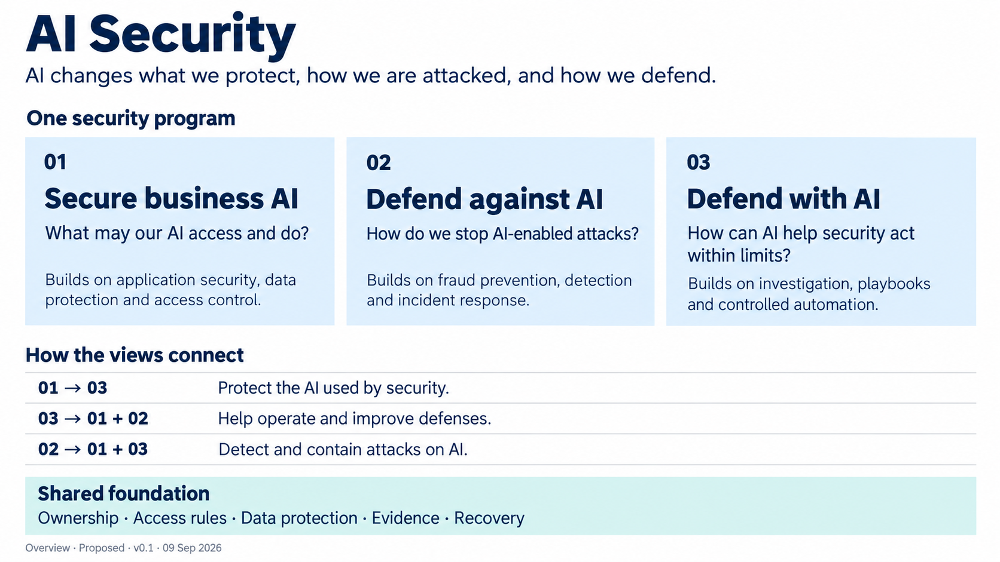

# AI Security Reference Architectures

**Review draft · September 2026**

**Read the website: [ai.jessepike.dev](https://ai.jessepike.dev)**

This repository maintains our **canonical AI Security & Governance package**: a shared foundation for orientation, awareness and education, future exploration and evolution, and intended ePlus AI Ignite and AI Security & Governance GTM adaptations. The [governing intent](https://github.com/jessepike/ai-security-reference-architectures/blob/main/intent.md) records that direction. The [project guide](content/project-guide.md) connects the intent, roadmap, status, backlog, decisions and maintained sources. The intended downstream role does not establish ePlus adoption or endorsement.

Organizations need to decide where AI belongs in their work and protect the work that depends on it. **Governance directs AI use. Security protects it. Evidence from real use informs the next decision.**

The [shared story](content/00-ai-security.md) explains how these responsibilities work together, using a supplier-payment example. Governance establishes decision rights and conditions for use. Security helps assess proposed uses, implements protections with delivery teams, and returns evidence for reassessment. Business results and wider impacts also inform continued use.

Within this story, AI changes what we protect, how we are attacked, and how we defend. This library explains three connected security views:

1. **Secure business AI** — what may an AI workflow access and do?
2. **Defend against AI** — how do we interrupt AI-enabled attacks?
3. **Defend with AI** — how can AI help security act within limits?

This image depicts the three security views. Read it with the [AI Governance companion](content/04-ai-governance.md), then explore the [architect guides](content/guide-index.md). Images and presentation downloads accompany the browser-readable website.

The governance companion explains who decides, which conditions apply, what evidence is required and when a decision must be revisited. It connects to all three security views and covers wider AI risks and impacts. Start from a real situation and the next decision; name its accountable owner before selecting the relevant architecture views.

## Review status

The three component architectures received model-assisted critique with material reservations. The overview and presentation are subsequent additions. These are conceptual proposals, not a deployed design or a certification. Read the [open design questions](content/review-status.md) before implementation.

## Feedback

Email **[jesse@jessepike.dev](mailto:jesse@jessepike.dev?subject=AI%20Security%20Reference%20Architectures%20feedback)** with the architecture or section and your comment. A GitHub account is not needed to read the website or send email. GitHub contributors may open an issue.

## Authoring and maintenance

The [source map](content/source-map.md), [authoring standard](content/authoring-standard.md) and [template](content/templates/reference-architecture.md) support consistent work by people and agents. The site renders from Markdown in `content/`. Presentation sources live in `presentation/`. Public images and downloadable artifacts live in `public/`.

The [roadmap](https://github.com/jessepike/ai-security-reference-architectures/blob/main/ROADMAP.md) organizes development against the intended outcomes; the [backlog](https://github.com/jessepike/ai-security-reference-architectures/blob/main/BACKLOG.md) tracks work and evidence. [Status](https://github.com/jessepike/ai-security-reference-architectures/blob/main/status.md) summarizes current state, and [decisions](decisions.md) preserve rationale. Read [purpose](https://github.com/jessepike/ai-security-reference-architectures/blob/main/PURPOSE.md), [shared agent instructions](https://github.com/jessepike/ai-security-reference-architectures/blob/main/AGENTS.md), [contribution guidance](https://github.com/jessepike/ai-security-reference-architectures/blob/main/CONTRIBUTING.md), [validation](https://github.com/jessepike/ai-security-reference-architectures/blob/main/docs/validation.md) and [releasing](https://github.com/jessepike/ai-security-reference-architectures/blob/main/docs/releasing.md) when maintaining the package. The [downstream use contract](https://github.com/jessepike/ai-security-reference-architectures/blob/main/docs/downstream-use.md) explains source traceability and how learning returns from adaptations.

For the maintainer’s local arrangement, see the [workspace and repository layout](docs/workspace-layout.md). The public repository stays independent from the surrounding exploratory workspace.

Build the static site with `npm ci` followed by `npm run build`. Vercel publishes `dist/`. Local development and artifact builds use an isolated development environment.

No reuse license has been selected for this initial publication. Contact the author about redistribution or adaptation beyond the permissions provided by the hosting platform.
