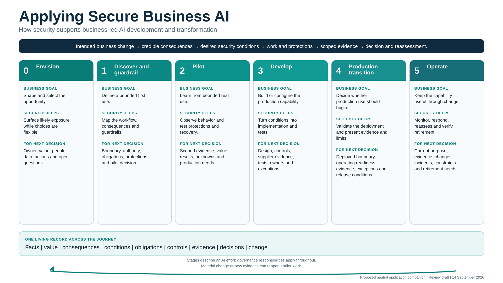

# CISO walkthrough: enable a safe first AI experiment

**Status:** Discussion draft | 15 September 2026

Use this walkthrough for a working conversation with a business team exploring AI. Its six stops organize the meeting. They are different from the six project stages in [Applying Secure Business AI](applying-secure-business-ai.md). This walkthrough gives practical treatment to Stage 0 Envision and the handoff into Stage 1 Discover and guardrail. For later stages, use the [full application guide](guides/applying-secure-business-ai-guide.md).

## 1. Approach and progressive enablement

**Question to discuss:** What useful learning can the business pursue now, and what protection should grow with the exposure?

The business leads the effort and owns the intended value. Security listens, makes likely exposure visible, helps shape a safe next experiment, operates protections assigned to security, and exercises delegated authority where it exists.

Progressive enablement means that controls deepen as the experiment touches more sensitive data, more people, external services, business systems, or consequential decisions. It is not a timer or permission to postpone a protection that the current experiment already needs.

The CISO should leave the first conversation with three things: the team's answers, an initial qualitative risk view, and guidance for the next bounded experiment. Learning returns to the same record and informs the next decision.

### Optional example

An invented customer-service team wants an assistant that drafts account-credit recommendations. Security helps the team start with an approved tool, invented cases, two designers, draft output, and no connection to customer or finance systems. This illustrates the approach; it is not test evidence or approval for a real use.

## 2. The full journey

**Question to discuss:** Where is this effort today, and what will the next decision require?

The complete journey has six stages:

| Project stage | What matters now or later |
|---|---|
| **0 Envision** | Shape the opportunity, make likely exposure visible, and choose the next useful experiment. This is the focus of the opening conversation. |
| **1 Discover and guardrail** | Map the actual boundary needed for the next test, assign relevant decisions, define guardrails, and check protections before actual data access or action. This walkthrough prepares the handoff. |
| **2 Pilot** | Observe bounded real use, test protections and recovery, and identify what broader use requires. |
| **3 Develop** | Build, buy, or configure the production capability and its testable protections. |
| **4 Production transition** | Reconcile and validate the deployed boundary before production use begins. |
| **5 Operate** | Keep evidence and protections current through change, incidents, expansion, and retirement. |

The stages describe an AI effort's journey. Governance responsibilities apply throughout, and the stages are not a maturity score. Use the [six-stage map](applying-secure-business-ai.md#the-six-progressive-stages) for orientation and the [detailed guide](guides/applying-secure-business-ai-guide.md) for later-stage questions, deliverables, and evidence.

### Optional example

The credit-assistant idea is in Stage 0 while it uses invented cases to explore draft quality. A proposal to use transformed historical cases requires the Stage 1 handoff. A live pilot, production build, release, and operation would use the existing guidance for Stages 2 through 5; this walkthrough does not invent separate playbooks for them.

## 3. Starter conversation

**Question to discuss:** What are you trying to improve, what do you want to try next, and what would that experiment actually touch?

One answer may be a sentence, and “unknown” is acceptable. An undecided future provider does not prevent exploration in a suitable existing approved tool or local boundary using public, invented, or synthetic material. It does prevent an experiment that depends on knowing where actual data goes or how access and retention work. Public or invented data does not make an unreviewed tool acceptable by itself.

If a use is already operating, first establish its current exposure and make an intake and containment decision through existing authority. The conversation does not grant permission retroactively. A safer parallel experiment can continue learning while the operating use is examined.

Ask the two conditional follow-ups only when they fit the approach. These questions open the conversation; they are not an approval form.

### Copyable starter questionnaire

> **1. Value and owner:** What business result are you trying to improve, how will you recognize useful progress, and who owns that result?
>
> **2. Approach:** Are you buying, building, enabling AI already embedded in a product, combining those approaches, or still deciding?
>
> **3. AI and architecture:** What tools, models, providers, and major components are known? What remains unknown? Add a rough sketch if one exists.
>
> **4. Data:** What information might go in or come out, where does it come from, how sensitive might it be, where might it go, and what is known about reuse or retention?
>
> **5. People and environment:** Who would use it, who could be affected, where would it run, and how would users get access?
>
> **6. Connections and actions:** What could it read, recommend, create, send, or change? Which integrations are contemplated, and where would a person review the result?
>
> **7. Consequences:** What could plausibly harm a person, customer, employee, business process, obligation, or important dependency if the AI is wrong, misused, manipulated, unavailable, or trusted too much?
>
> **8. Next experiment:** What is the smallest useful thing you want to try next, and is any version already operating?
>
> **If buying or enabling embedded AI:** Which provider and service are under consideration? What settings, data terms, retention, access controls, logs, change notices, and exit options are visible today?
>
> **If building or combining components:** Which model, retrieval source, tool, hosting environment, service identity, and evaluation method are contemplated? Which parts remain open choices?

### Optional example

The credit-assistant team wants faster, more consistent draft recommendations. It proposes 30 invented cases in an existing approved tool. Two designers use the restricted workspace, supervisors review selected drafts, and no output reaches a customer or business system. Provider selection and production architecture can remain unknown inside that boundary.

## 4. Initial risk view

**Question to discuss:** Given what we know today, what could go wrong, what would be affected, and what does security recommend for the next experiment?

Describe risk qualitatively. Connect credible scenarios to consequences and the actual exposure of the proposed experiment. Keep uncertainty visible, name only the decision owners needed now, and distinguish security advice from a binding condition or delegated security decision.

This view supports the first conversation. It is not a numeric score, complete assessment, approval, or proof that a protection works.

### Copyable initial risk view

> **Effort and date:**
>
> **Pending business decision and owner:**
>
> **Next experiment being considered:**
>
> **Credible scenarios:** What could go wrong through error, misuse, manipulation, weak access, excessive reliance, provider behavior, or failure?
>
> **Consequences:** Who or what could be affected? How serious and reversible could the effect be?
>
> **Current exposure:** Which people, data, environments, providers, integrations, actions, and dependencies would the next experiment touch?
>
> **Important unknowns:** Which missing facts could change the guidance? Which can remain open because the current boundary avoids them?
>
> **Initial security recommendation:** Proceed within a stated boundary, narrow the experiment, use a safer alternative, investigate a named unknown, or pause the affected activity.
>
> **Relevant decision and action owners:** Name only the roles needed for the current questions. One person may hold several roles.
>
> **Limits:** State what this view does not assess or permit.

### Optional example

The credit assistant may produce inconsistent drafts, follow misleading case text, or encourage too much reliance. Actual customer data could be exposed if the boundary is ignored. The current exposure is limited to two designers, invented cases, an approved tool, and draft output. Security recommends proceeding inside that boundary. The service leader owns the value decision; security operates workspace access; data and privacy owners join before any transformed historical record is considered.

## 5. Bounded experiment guidance

**Question to discuss:** What may happen now, what waits, and what must be checked before exposure expands?

The boundary should allow useful learning while avoiding exposure the team is not ready to manage. State the allowed people, data, destination, outputs, and actions. “Use clean data” or “be careful” is not enough.

Final product selection, production architecture, enterprise monitoring, and detailed recovery may wait when the current experiment does not depend on them. Actual data transfer, external destinations, business-system access, consequential reliance, or action require the relevant facts, owners, protections, and evidence before the boundary expands.

### Copyable experiment guidance

> **Purpose of the experiment:**
>
> **What may happen now:** Users, environment, allowed data, provider or local tool, outputs, and actions.
>
> **What must not happen in this experiment:** Prohibited data, destinations, integrations, actions, reliance, or expansion.
>
> **What can wait:** Questions and production work the current boundary does not require.
>
> **What must be checked before exposure expands:** Facts, assigned decisions, protections, and evidence needed before actual data, external transfer, more users, system access, consequential reliance, or action.
>
> **How the team will learn:** What it will observe, test, or compare about business value and unwanted behavior.
>
> **Stop and help route:** What stops the experiment, who can stop it, and who the team contacts.
>
> **Owner and revisit date or trigger:**

### Optional example

Two designers may compare credit drafts for 30 invented cases in the approved tool. No live or transformed customer data, new provider, customer contact, integration, account write, or automated decision is allowed. The team records useful, corrected, rejected, and manipulated-case results. It stops if real-derived data appears or the approved-tool boundary changes.

## 6. Handoff and where the journey goes

**Question to discuss:** What new exposure makes Stage 1 necessary, and what must the next team understand or check?

Move into Stage 1 when the next test introduces actual or sensitive data, an external transfer, more users, a provider decision, retrieval, an integration, read or write access, consequential reliance, or a formal pilot. The first-conversation view is then revisited using the real workflow and boundary.

Stage 1 deepens the facts, relevant decisions, guardrails, and evidence needed for the next bounded test. It checks applicable access, data, action, human-review, logging, stop, recovery, and provider protections before actual data access or action. It does not require every production control at once.

After the handoff, use the existing guidance for [Pilot, Develop, Production transition, and Operate](guides/applying-secure-business-ai-guide.md#stage-2--pilot). The same living record carries learning, evidence, decisions, conditions, and change forward.

### Copyable Stage 1 handoff

> **Business purpose and next decision:**
>
> **Stage 0 experiment and learning:** What was tried, within which boundary, and what was learned about value and exposure?
>
> **Proposed next bounded test:**
>
> **Specific facts to deepen:** Only the workflow, data, identities, providers, integrations, human effects, consequences, and obligations needed for that test.
>
> **Controls to check before actual data or action:** Identify applicable access, data, action, human-review, logging, stop, recovery, and provider controls. State how they will be checked.
>
> **Open decisions and assigned owners:** Include only the business, data, privacy, legal, safety, security, exception, or other decisions relevant now.
>
> **Evidence needed for the pilot decision:**
>
> **Interim boundary:** What remains restricted until the facts, protections, and decisions above are resolved?

### Optional example

The credit-assistant team proposes a time-limited test using reviewed, transformed historical cases. Output remains draft-only and disconnected from customer and finance systems. Before that boundary changes, the team checks the transformation method, residual identifiers, provider destination and retention, workspace identities, logging, deletion, supervisor rejection, and immediate shutdown. Invented cases remain the boundary until the assigned data and privacy owners permit the transformed set and the required checks produce usable evidence.

This walkthrough is a discussion draft. It has not been field validated, independently reviewed, or accepted for a particular use. The [starter playbook](../docs/exploration/secure-business-ai-starter-playbook.md) retains the fuller exploratory rationale and worked example.
