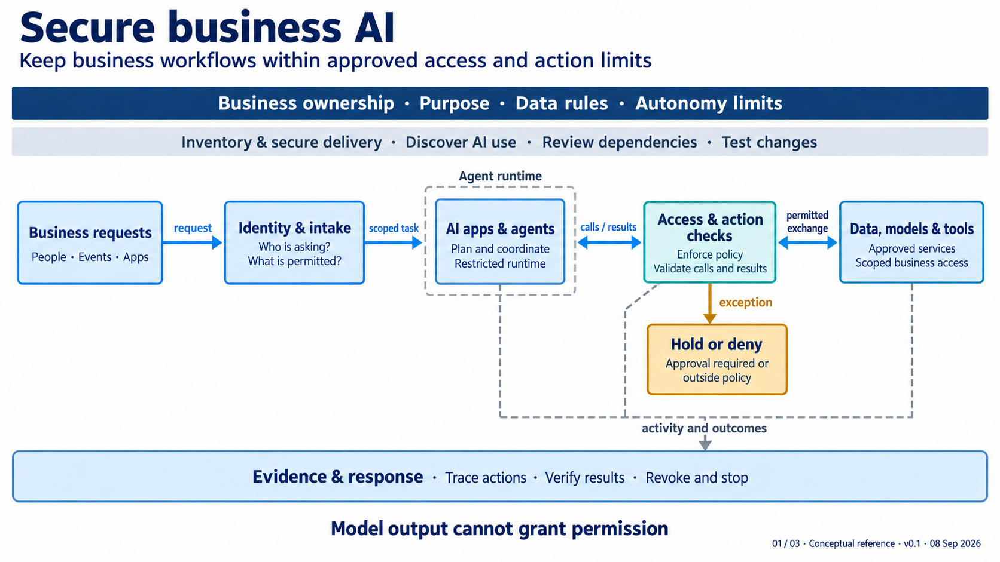

# Secure business AI: architect reference guide

**Guide version:** 0.1 | **Prepared:** 8 September 2026 | **Architecture:** 01 / 03

**Status:** Proposed logical architecture with implementation guidance. Design choices below are authoring decisions for this reference package, not approved decisions for an enterprise deployment.

**Canonical architecture:** [01-secure-business-ai.md](../01-secure-business-ai.md). **Visual:** [01-secure-business-ai.png](../../public/images/01-secure-business-ai.png).

## Contents

1. [Purpose and reading rules](#1-purpose-and-reading-rules)
2. [Decisions represented in the architecture](#2-decisions-represented-in-the-architecture)
3. [Every element explained](#3-every-element-explained)
4. [Connections and boundaries](#4-connections-and-boundaries)
5. [Implementation patterns and interface contracts](#5-implementation-patterns-and-interface-contracts)
6. [Worked workflow](#6-worked-workflow)
7. [Failure handling and operations](#7-failure-handling-and-operations)
8. [Validation and architect handoff](#8-validation-and-architect-handoff)
9. [Glossary and sources](#9-glossary-and-sources)

## 1. Purpose and reading rules

The image answers: **How can a business use AI to perform work without allowing that workflow to choose its own access rights?** It covers assistants, AI embedded in business applications and agents that plan and use tools. The intended outcome is expressed in the subtitle, “Keep business workflows within approved access and action limits.” Approved means authorized through the organization's actual decision process; the image does not establish those limits.

This is a logical reference architecture. Boxes describe responsibilities and interfaces. A box might be implemented by several services, and one platform might provide parts of several boxes. Placement outside the agent runtime indicates a required separation of authority; it does not require a separate appliance for every control.

The five central boxes show a request path and the agent's exchanges with resources. The upper bands describe business direction and preparation. The lower band describes evidence and operational response. They apply throughout the workflow and are not steps that happen only once.

The canonical Markdown controls the high-level meaning. This guide explains that meaning and adds explicitly proposed implementation detail. If a deployment requires a materially different flow, record the change and revise the canonical architecture and image together. Do not quietly treat the guide as a replacement architecture.

The “01 / 03” footer identifies this view within the series. “Conceptual reference” describes its altitude; version and date identify the artifact, not a deployed release. The colors aid reading: navy for governing rules, blue for components and exchanges, teal for enforcement, amber for exceptions, and gray dashed outlines for boundaries. Security does not depend on color recognition.

## 2. Decisions represented in the architecture

These choices explain why the view has its current shape. Revisit conditions are prompts for design review, not automatic permission to weaken a control.

| ID | Choice and rationale | Alternative and tradeoff | Revisit when |
|---|---|---|---|
| BAI-D01 | Organize around a business workflow so purpose, data access and effects can be assessed together. | A model-only diagram is simpler but leaves tool access and business consequences unexplained. | The scope becomes model training or a customer-facing AI product. |
| BAI-D02 | Keep access and action enforcement outside model reasoning. A model must not grant itself permissions. | Prompt instructions alone are inexpensive but cannot enforce resource access. | A platform changes where enforceable checks can be placed; preserve the separation of authority. |
| BAI-D03 | Check resource exchanges in both directions. Retrieval and model calls can disclose data even without a business write. | A write-only gate misses read access, outbound prompts and returned content. | New resources, data classes or provider services are added. |
| BAI-D04 | Bind authority to the initiator and task. The workflow should not inherit unrestricted user access. | A shared service account simplifies integration but weakens attribution and separation. | An integration cannot carry initiator context; document compensating restrictions. |
| BAI-D05 | Combine data, models and tools in one high-level resource box to keep the visual readable. | Separate boxes expose more boundaries but increase visual complexity. | Producing the next-level deployment view; split these resources there. |
| BAI-D06 | Show holds and denials explicitly so uncertainty has an operational destination. | Treating every error as retryable can repeat actions or bypass review. | Approval rules or service availability requirements change. |
| BAI-D07 | Include inventory, delivery and evidence across the workflow. Runtime checks need known components and observable outcomes. | A runtime-only view is shorter but omits change and incident risks. | Ownership or release processes move between teams. |
| BAI-D08 | Use business-system evidence to verify effects. Agent narration does not establish that an action succeeded. | Trusting tool status alone is faster but may miss partial completion. | Destination systems change their result or reconciliation interfaces. |

The arrangement is informed by the agent and application risks in [OWASP's agentic guidance](https://genai.owasp.org/resource/owasp-top-10-for-agentic-applications-for-2026/) and [LLM guidance](https://genai.owasp.org/resource/owasp-genai-llm-top-10-2026/). These sources inform threat selection; they do not mandate the diagram's boxes or certify a deployment.

## 3. Every element explained

### 3.1 Business ownership: purpose, data rules and autonomy limits

**Meaning.** “Business ownership” makes someone accountable for the workflow's purpose and consequences. “Purpose” describes the work it exists to perform. “Data rules” define permitted information use and disclosure. “Autonomy limits” define which steps can proceed without a new human decision.

**Inputs and outputs.** Business needs, affected processes, data classifications and risk tolerance become a workflow charter and enforceable rules. A useful charter records permitted actions, forbidden outcomes, escalation contacts, acceptance evidence and retirement conditions.

**Implementation.** The business process owner defines the acceptable outcome; security, data and platform functions help translate it into controls. These are suggested responsibilities, not assigned people. Each rule needs a named decision owner and an implementation owner. A broad instruction such as “help customers” is insufficient to authorize a refund or disclosure.

**Evidence and open question.** Keep the current charter, policy version and approval record. The architect must resolve who can change the limits and how that change reaches enforcement without the agent modifying its own authority.

### 3.2 Inventory and secure delivery: discover AI use, review dependencies, test changes

**Meaning.** Inventory includes employee tools, embedded AI features, workflow definitions, agents, model services, retrieval indexes, memory stores, tool servers and identities. “Discover AI use” includes unsanctioned use where observable. “Review dependencies” includes software, models, tools, prompts, configurations and upstream service relationships. “Test changes” includes behavioral changes, not only code changes.

**Inputs and outputs.** Discovery, application ownership and delivery records produce a maintained inventory with owners, versions, data access and deployment locations. Use a shared identifier to link an operational event back to its workflow and component versions.

**Implementation.** Review new connectors and tool descriptions before enabling them. Restrict who can alter workflow instructions, credentials or retrieval sources. A provider update can change behavior without a local code release, so determine how such changes are noticed and evaluated.

**Evidence and limitation.** Retain release evidence, dependency records and test results. Discovery will have coverage gaps; record them rather than calling the inventory complete without measurement.

### 3.3 Business requests: people, events and apps

**Meaning.** This box contains initiation channels. A person might submit a request; an event might start scheduled reconciliation; another application might call the workflow. The source channel is not proof that the request is legitimate.

**Inputs and outputs.** Capture the request, claimed purpose, initiating identity or service, relevant record scope and a correlation identifier. Output is a request for intake evaluation, not authorization to perform every action mentioned in its content.

**Implementation.** Distinguish a known trigger from attacker-controlled content carried by that trigger. Email, uploaded documents and event fields may contain instructions that conflict with the workflow's rules. Protect event authenticity and define how duplicate or delayed triggers are handled.

**Evidence and question.** Record enough origin information to trace the request without unnecessarily storing sensitive payloads. Decide who owns unattended schedules, when that ownership expires, and whether a replay should create new work or resume existing work.

### 3.4 Identity and intake: who is asking, what is permitted

**Meaning.** Authentication answers who is presenting the request; authorization answers what that identity may do in this context. A valid sign-in does not authorize every business action. Intake also applies submission and data-use rules.

**Inputs and outputs.** Validate the initiating identity, workflow identity, request purpose and relevant account or tenant. Produce a scoped task carrying references to authenticated context and applicable policy. Treat a user ID supplied in free text as a claim to validate, not trusted identity.

**Implementation.** Separate agent/workload credentials from human credentials. Where the agent acts on behalf of someone, constrain access by both its own permitted role and the represented person's permitted scope. Recheck rights later when necessary; intake cannot predict every future tool call.

**Evidence and question.** Retain an intake decision with reason and policy version. Decide how service-initiated work obtains authority, how account recovery is protected, and how rights changes affect queued or long-running tasks. [NIST authentication guidance](https://pages.nist.gov/800-63-4/sp800-63b.html) informs identity design; it does not establish business transaction authority.

### 3.5 AI apps and agents: plan and coordinate, restricted runtime

**Meaning.** This component interprets the task, invokes a model where needed, maintains task state and coordinates steps. The dashed “Agent runtime” box distinguishes its execution context from the controls that constrain it.

**Inputs and outputs.** Inputs are a scoped task and permitted results from resources. Outputs are proposed calls, intermediate conclusions and a response for the business application. Proposals remain subject to enforcement.

**Implementation.** Limit reachable networks, writable storage, command execution, credentials, iteration counts and resource consumption. Select restrictions from the workflow's needs. Multi-agent delegation should preserve the initiating task and narrow or maintain scope. Shared memory requires access and write controls; it must not become an informal channel for new authority.

**Evidence and limitation.** Capture task steps, tool requests and versions needed for investigation. Hidden model reasoning is neither a required audit record nor reliable proof of intent. A sandbox reduces reachable harm; its boundary and potential escape paths still require testing. NCSC's [interim agentic guidance](https://www.ncsc.gov.uk/blogs/managing-the-cyber-risk-of-agentic-ai) supports proportionate isolation, oversight and interruption.

### 3.6 Access and action checks: enforce policy, validate calls and results

**Meaning.** This box represents enforcement across resource access, inference requests, retrieval, tool use and returned outputs. It may include several decision and enforcement points. “Enforce policy” refers to enforceable rules; “validate” includes format, target, scope and content checks appropriate to each interface.

**Inputs and outputs.** Evaluate the caller, represented identity, resource, operation, parameters, destination, task context and policy version. Output is a permitted scoped operation, a held operation, or a denial with a reason. Returned results are checked before they are used or disclosed.

**Implementation.** Resource servers retain final access checks. Prevent alternate paths that bypass a tool adapter or gateway. Separate model-based detection of suspicious content from the technical authorization boundary. A classifier can flag risk; it must not expand permissions. Bind any human approval to the exact action and invalidate it if material parameters change.

**Evidence and question.** Store the decision and destination result together using a correlation ID. Determine which calls can actually be intercepted and how failures are handled. [OWASP ACS](https://genai.owasp.org/resource/agent-control-standard-acs/) is emerging runtime-control work, not proof that an installed hook covers every execution path.

### 3.7 Data, models and tools: approved services, scoped business access

**Meaning.** This aggregated box contains three different resource families. Data includes business records, retrieval indexes and memory. Models include local or hosted inference. Tools include business APIs, command adapters and connectors, including Model Context Protocol (MCP) where used.

**Inputs and outputs.** Each resource receives only the permitted call and necessary data, and returns a result or error. A model call can disclose prompt data to a provider; a retrieval call can expose restricted records; a tool call can change business state. They need distinct policies even when they share an adapter.

**Implementation.** Filter retrieval by actual source permissions and define how permission changes propagate to caches and indexes. Scope memory by workflow, user or tenant as required. Assess provider data handling and retention. Validate tool identities and definitions, and constrain outbound destinations. Tool connectivity or an “approved” service label does not authorize every use of that service.

**Evidence and question.** Record resource identity, operation and outcome. The next-level architect must split this box into real systems, data flows and provider boundaries, including cached data and any indirect disclosure routes.

### 3.8 Hold or deny: approval required or outside policy

**Meaning.** A hold waits for a valid decision or missing prerequisite. A denial terminates the prohibited attempt. The visual combines these outcomes to save space; implementation must distinguish them.

**Inputs and outputs.** A held action needs an immutable description of its target, operation and material parameters, an expiry condition and an authorized reviewer. Output may be an approved resubmission, rejection, cancellation or expiry. A prohibition does not become permissible simply because someone clicks approve; policy changes require their own authority.

**Implementation.** Prevent execution while held. Avoid retry loops, alternate-tool attempts or escalation to a more privileged agent. When approval arrives, revalidate relevant state before execution. A new amount, account or destination requires a new decision when it changes the approved action.

**Evidence and question.** Retain who decided what, against which version, and whether it was actually executed. Resolve reviewer availability, timeout behavior, conflicts of interest and how urgent work is handled without an agent inventing a bypass.

### 3.9 Evidence and response: trace actions, verify results, revoke and stop

**Meaning.** Tracing reconstructs a workflow; verification establishes actual effects; revocation removes future access; stopping interrupts active or queued work. These are different functions and may live in separate services.

**Inputs and outputs.** Collect task, authorization, resource and outcome records. Produce investigation evidence, alerts, verified completion, stop requests and recovery actions. Protect the evidence store from alteration by the workflow it monitors.

**Implementation.** Correlate records across services and protect timestamps and event integrity. Minimize sensitive payloads; restrict access and retention. Capture a record of an action rather than assuming every raw prompt or document must be copied into logs. Define how revocation reaches running processes, child agents, queues and active sessions.

**Evidence and limitation.** Verify an action against destination state. Revocation may not undo an in-flight operation or withdraw information already disclosed. The architect must define detection latency, audit-loss behavior and recovery capability for each consequential action.

## 4. Connections and boundaries

| Visible connection | What crosses it and what it means |
|---|---|
| “request”: requests to intake | Proposed business work plus origin information; not a grant of rights. |
| “scoped task”: intake to agent | Validated task context and references to permissions; later calls still need checking. |
| “calls / results”: agent and checks | Proposed operations outbound; allowed results or explicit exceptions inbound. The two arrowheads show exchange, not equal authority. |
| “permitted exchange”: checks and resources | Authorized requests and appropriately handled replies. Includes model inference and retrieval as well as writes. |
| “exception”: checks to hold/deny | An action that cannot proceed immediately. No implied permission to execute while waiting. |
| “activity and outcomes”: runtime, checks and resources to evidence | Records supporting observation and verification. The common bus is logical aggregation, not a shared writable log owned by the agent. |

Four boundaries need deeper design: initiator to delegated workflow; untrusted content to application instructions; proposed action to an actual effect; and execution to independent evidence. The image's principle, **“Model output cannot grant permission,”** applies at each relevant boundary. It does not claim that model output is always wrong, or that authorized output is necessarily correct.

The drawing omits the final response path back to the user, management interfaces, approval resubmission and recovery control messages. For implementation, draw them explicitly. User-facing output needs appropriate validation and disclosure checks. The telemetry line from identity/intake is also omitted for readability; include its decisions in the evidence design. These are clarifications of a high-level view, not a complete network diagram.

## 5. Implementation patterns and interface contracts

### Deployment choices

**Managed SaaS AI:** Map each logical control to provider configuration, enterprise identity, application permissions and available audit records. If an internal boundary cannot be inspected or enforced, record that limitation and constrain the workflow. Do not draw an imaginary inline gateway around provider-internal operations.

**Custom application with hosted models:** Separate orchestration, model routing, retrieval and business tool execution in the detailed design. Keep secrets in an appropriate credential service and limit which component can use them. The picture's resource exchange is repeated for each model or tool call; it is not a requirement to send a model through itself recursively.

**Agents with code execution or delegation:** Identify the parent task, child identities, delegated scope, network paths and termination behavior. Restrict both the command-execution environment and the orchestrator's own integrations. Decide which results may enter shared memory and who can change tool definitions.

### Proposed minimum records

| Record | Fields an architect should resolve |
|---|---|
| Task context | Workflow/version, task ID, authenticated initiator, agent identity, purpose, permitted resource scope, expiry. |
| Action request | Task ID, tool/version, operation, target, material arguments, intended effect, relevant evidence. |
| Decision | Allow/hold/deny, reason, applicable policy/version, approver where required, action binding, validity conditions. |
| Action result | Destination identifier, execution status, result reference, partial-effects indication, reconciliation status. |
| Operational event | Correlation ID, source, event time, receipt time, access classification and retention rule. |

These are logical fields, not a prescribed protocol or schema. Repeated operations need duplicate prevention or reconciliation appropriate to the destination. An “idempotency key” is useful only if the receiving service honors its semantics.

## 6. Worked workflow

A customer-service agent is asked to resolve a disputed charge. No numerical credit threshold is assumed; the business owner must set it.

1. **Initiate:** A customer request and case ID enter through a permitted channel. An attached document is content to inspect, not a new policy.
2. **Scope:** Intake validates the service context and account association. It establishes which records the workflow may read.
3. **Analyze:** The agent requests account information. Resource checks limit retrieval to the permitted account, including cached results.
4. **Propose:** The agent proposes a credit with amount, currency, destination and rationale. The action control evaluates the exact proposal.
5. **Decide:** If policy requires a person, the workflow holds the credit. If the proposal violates a prohibition, it is denied. The person sees relevant evidence and business impact.
6. **Execute:** A valid approval permits the scoped operation through the controlled adapter. A changed destination triggers reevaluation.
7. **Verify:** The finance system supplies a transaction reference. The workflow reconciles actual state before telling the customer the credit completed.
8. **Handle uncertainty:** If the tool times out after submission, check destination state before retrying. If state cannot be established, record an uncertain outcome and escalate.

Test variants include a forged customer reference, hostile attachment, deleted user permission, changed tool definition and cancellation during execution. The reference architecture states the intended protections; only implementation tests can show whether they hold.

## 7. Failure handling and operations

| Condition | Proposed behavior and architectural question |
|---|---|
| Identity or policy cannot be validated | Hold consequential work. Define any independently authorized emergency procedure; do not allow the agent to invent one. |
| Approval expires or action parameters change | Reevaluate and obtain the required new decision. Define which changes are material. |
| Model or provider unavailable | Queue, return a clear failure, or use an assessed fallback appropriate to the workflow; a substitute model is a configuration change. |
| Audit delivery unavailable | Define per-action behavior, durable buffering and loss alerts. High-consequence actions may need to stop when required evidence cannot be preserved. |
| Repeated tool failures or runaway loop | Bound retries, resource consumption and delegation; stop or escalate after defined conditions. |
| Compromise or revoked authority | Stop new work, invalidate access, cancel pending actions where possible, and reconcile in-flight effects. |
| Sensitive data was disclosed | Stop further disclosure and invoke the applicable incident process. Deleting an agent's memory does not recover data already sent elsewhere. |

Ownership suggestions are business process owner for outcomes, application/platform owner for execution, identity and data owners for access, security operations for monitoring, and service owners for recovery. The deployment design must assign actual accountable roles and define escalation across their boundaries.

## 8. Validation and architect handoff

Each check should name its test environment, expected result, evidence source and reviewer. Local acceptance thresholds and recovery objectives remain to be decided.

| Test | Observable acceptance evidence |
|---|---|
| Cross-account retrieval attempt | Receiving data service denies unauthorized records, including cache/index paths. |
| Malicious retrieved instruction | Attempt cannot change permissions or execute an unauthorized tool call; useful evidence is retained. |
| Gateway bypass attempt | Direct and alternate paths are denied at network, credential or destination controls. |
| Approval substitution | Changed target or material arguments cannot reuse approval intended for another action. |
| Mid-task revocation | Subsequent calls stop within the specified objective; in-flight effects are reconciled. |
| Timeout followed by retry | Duplicate business effects are prevented or detected and reconciled. |
| Agent-to-agent delegation | Child permissions do not exceed the authorized task; task attribution remains reconstructable. |
| Model/tool/data change | Representative and adversarial cases are rerun before restoring the intended operating limits. |
| Evidence access test | The agent cannot rewrite its audit history; unauthorized users cannot read sensitive traces. |
| Service recovery | The affected business process and data are verified after restoration or compensation. |

Before deployment, supply the workflow charter, actual system and provider boundaries, data classification and access model, identity/delegation design, tool and model inventory, action decision table, error semantics, logging/retention design, evaluation plan and operational runbook. Record residual risks and the person authorized to accept them. An architect should be able to trace each consequential operation to an enforcement point and an independent result record.

Architecture 2 supplies the broader attacker perspective; architecture 3 describes security workflows that may help operate these controls. Security agents using those capabilities require this same access and action discipline.

## 9. Glossary and sources

| Term | Meaning in this guide |
|---|---|
| Agent | A system that selects or coordinates steps and can use tools toward a task. |
| Delegation | Giving another actor bounded authority for identified work. |
| Enforcement point | The place where an actual request can be allowed or blocked. |
| Inference | Invoking a model to obtain an output. |
| Retrieval / RAG | Selecting information to supply as model context; retrieval-augmented generation does not replace source permissions. |
| MCP | Model Context Protocol, an integration mechanism; protocol use does not establish trust or authorization. |
| Provenance | Information about where content, a component or an event came from. |
| Reconciliation | Comparing intended and recorded effects to determine actual state. |

Public sources were checked on 8 September 2026. The complete series research record is [sources.md](../sources.md). This guide's detailed interfaces, records, scenarios and tests are proposed design elaborations.

- [NIST Cyber AI Profile](https://www.nccoe.nist.gov/projects/cyber-ai-profile): the three-part framing; the linked profile remains an initial preliminary draft.
- [OWASP Agentic Applications 2026](https://genai.owasp.org/resource/owasp-top-10-for-agentic-applications-for-2026/): agent-specific threat categories.
- [OWASP LLM Top 10 2026](https://genai.owasp.org/resource/owasp-genai-llm-top-10-2026/): application risks; the publisher page is dated August 2026.
- [OWASP Agent Control Standard](https://genai.owasp.org/resource/agent-control-standard-acs/): emerging control-hook and observability work, introduced on the OWASP page in September 2026.
- [NCSC agentic AI advice](https://www.ncsc.gov.uk/blogs/managing-the-cyber-risk-of-agentic-ai): August 2026 interim practical advice; further formal guidance is in development.
- [NIST SP 800-63B-4](https://pages.nist.gov/800-63-4/sp800-63b.html): authentication and authenticator management. The guide does not claim compliance with its requirements.

This guide remains a review draft. Consult the published review status for unresolved findings.
