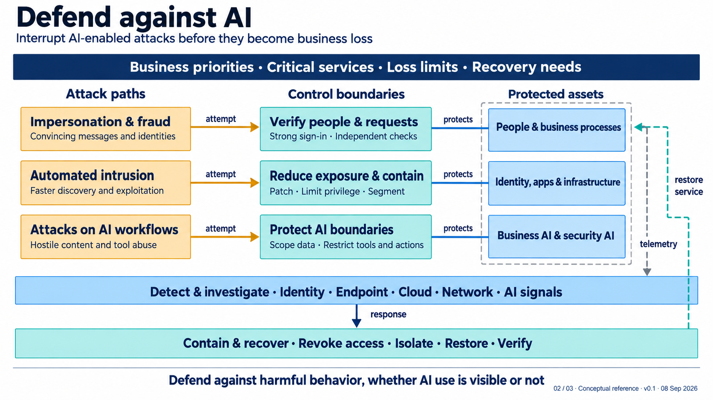

# Architecture 02 Defend against AI Architect Reference Guide

**Status:** Proposed logical reference architecture, version 0.1, 8 September 2026. This guide records no accepted decision, implementation commitment, product selection, or effectiveness claim.

**Audience:** Enterprise, security, identity, application, cloud, data and AI architects.

**Authority and scope:** [Architecture 02](../02-defend-against-ai.md) defines the proposed logical view; this guide explains it. [The diagram](../02-defend-against-ai.png) is the visual reference. **Design elaboration** identifies questions and behavior, not additional boxes, mandated integrations, or approved requirements. The view remains relevant when AI use is absent or cannot be observed.

## Contents

1. [Purpose and reading the view](#1-purpose-and-reading-the-view)
2. [Logical capability model](#2-logical-capability-model)
3. [Attack paths and control boundaries](#3-attack-paths-and-control-boundaries)
4. [Protected-assets boundary and shared services](#4-protected-assets-boundary-and-shared-services)
5. [Connector, band, and boundary semantics](#5-connector-band-and-boundary-semantics)
6. [Proposed decision register](#6-proposed-decision-register)
7. [Representative worked threat scenarios](#7-representative-worked-threat-scenarios)
8. [Operating and resilience considerations](#8-operating-and-resilience-considerations)
9. [Requirements and testable acceptance checks](#9-requirements-and-testable-acceptance-checks)
10. [Relationship to the other reference architectures](#10-relationship-to-the-other-reference-architectures)
11. [Architect questions](#11-architect-questions)
12. [Glossary](#12-glossary)
13. [Sources and guidance status](#13-sources-and-guidance-status)

## 1. Purpose and reading the view

The outcome is to reduce fraud, compromise, data loss, and disruption when attackers use AI to improve their operations. The architecture connects attack paths, interruption boundaries, and detection, containment, and recovery capabilities.

Read each row left to right: amber describes an attack path, teal an interrupting boundary, and light blue a protected asset class. Rows are parallel examples, not a sequence or complete taxonomy.

The subtitle, **“Interrupt AI-enabled attacks before they become business loss,”** states the intended outcome, not a prevention guarantee. The top band supplies business context. The lower blue and teal bands are shared services. The bottom principle, **“Defend against harmful behavior, whether AI use is visible or not,”** means response should use observable behavior and consequence; it should not wait for proof that AI was involved.

The footer, **“02 / 03 · Conceptual reference · v0.1 · 08 Sep 2026,”** identifies this as the second of three related conceptual references, gives its proposed version, and records the visual's date. It does not imply that the three views are accepted implementation phases or an approved roadmap.

## 2. Logical capability model

The diagram is a logical capability view: it says what must be achieved and how information or authority should flow. A physical design selects the people, processes, platforms, integrations, locations, and operating agreements. A service may implement several capabilities, and a capability may be distributed across services. This guide selects no product.

**Business priorities, critical services, loss limits, and recovery needs.** The top band supplies context for preventive design, response authority, restoration order, and evidence. **Business priorities** are the outcomes and obligations that guide security choices. **Critical services** are the business services whose interruption or misuse has material consequence. **Loss limits** are the kinds of loss the business considers unacceptable or needs to constrain, such as an unauthorized transfer, harmful disclosure, extended service disruption, or unsafe action; they are not universal numeric thresholds. **Recovery needs** state the required service, data, access, reconciliation, and evidence outcome after an incident. Likely contributors are business-service owners, risk, continuity, technology, and security. **Design elaboration:** relate each critical service and dependency to its sensitive decision and recovery evidence.

**Attack paths.** The left column supports scenario selection from threat intelligence, incident learning, service architecture, exposure, and business-process analysis. [MITRE ATT&CK](https://attack.mitre.org/) can help select enterprise behavior and [MITRE ATLAS](https://atlas.mitre.org/) AI-system behavior; neither proves local occurrence.

**Control boundaries.** The middle column constrains a request or attempted action through workflow, authorization, identity, segmentation, data-access, verification, or recovery controls. Its output may be an allow, deny, step-up, defer, quarantine, or evidence-generating result. It needs enough context for investigation without assuming every signal is centrally available.

**Protected assets.** The right column names asset classes whose integrity, confidentiality, availability, or authorized use matters. It is neither an inventory nor a compromise declaration. AI is included because it may reach data or systems.

**Detect and investigate.** The blue band combines identity, endpoint, cloud, application, network, AI-workflow, transaction, and business-process evidence to produce a scoped hypothesis and containment recommendation. Likely functions include security operations, incident response, identity, cloud, application operations, fraud operations, and service owners. **Design elaboration:** preserve timestamps, source identity, authorization context, and provenance; model output is not proof.

**Contain and recover.** The teal band turns an authorized response into revocation, isolation, blocking, restoration, and service-verification evidence. Likely functions include incident response, infrastructure and application operations, identity operations, continuity, service owners, and business-control functions. “Restore” and “verify” are separate: a rebuilt component does not prove that the business service, data, and access state are acceptable.

## 3. Attack paths and control boundaries

### 3.1 Impersonation and fraud → Verify people and requests

The first amber box represents convincing messages and identities, including email, chat, voice, video, or a compromised account. AI can improve realism and volume, but this row does not assume the content is synthetic. The protected asset is people and business processes, especially sensitive changes such as payment, supplier, beneficiary, privileged-access, or account-recovery changes.

The teal boundary uses strong sign-in and independent checks. [Phishing-resistant authentication](https://www.cisa.gov/sites/default/files/2023-01/fact-sheet-implementing-phishing-resistant-mfa-508c.pdf) helps defend sign-in, but does not authorize a high-consequence change. Independent verification uses a route or evidence source established apart from the request and the relevant business approval process. Input is a request or change; output is a decision, evidence, or escalated exception. Likely functions are business-process design, fraud controls, identity, help desk, privileged-access administration, finance operations, and security.

**Design elaboration:** identify the authoritative request, requester binding, changes needing re-verification, and help-desk recovery method. Consider compromised callback details, collusion, weak recovery, and unavailable channels. Defer sensitive action safely and define a time-critical exception route. Evidence includes authentication, verification, approval, request, transaction, and session records.

### 3.2 Automated intrusion → Reduce exposure and contain

The second amber box represents faster discovery and exploitation. AI may help attackers find exposed assets, draft exploit variants, identify likely credentials, or scale targeting; it does not make every intrusion autonomous. The protected asset is identity, applications, and infrastructure, including connected services that enable a path to more critical systems.

The teal boundary combines patching, privilege limitation, and segmentation to reduce reachable weakness and constrain a compromised identity, endpoint, workload, application, or service connection. Inputs include exposure and configuration, software and identity changes, access requests, and service topology. Outputs include verified remediation, constrained authorization, an isolated path, or evidence that a change failed.

Likely functions include asset and configuration management, exposure management, engineering, cloud and network architecture, endpoint operations, identity, application owners, and security operations. **Design elaboration:** prioritize reachability and service consequence, then verify the changed asset or path. A remediation ticket is not proof of closure.

Limitations include incomplete discovery, transient assets, legacy dependencies, exceptions, and trusted relationships that cross a segment. Detection also needs session misuse and lateral behavior. Evidence includes asset identity, exposure observations, configuration, change provenance, effective privileges, path testing, and telemetry.

### 3.3 Attacks on AI workflows → Protect AI boundaries

The third amber box represents hostile content and tool abuse directed at AI workflows. Examples include instructions embedded in untrusted content, attempts to redirect an agent's goal, retrieval or context manipulation, unsafe output passed to another system, misuse of a tool, and unauthorized memory writes. These are design cases, not claims that all AI systems expose every interface. [OWASP LLM](https://genai.owasp.org/resource/owasp-genai-llm-top-10-2026/) and [agentic-application](https://genai.owasp.org/resource/owasp-top-10-for-agentic-applications-for-2026/) risk material can inform scenario selection; it is a risk taxonomy, not this architecture.

The teal boundary scopes data and restricts tools and actions so a workflow cannot gain authority from persuasive text or a plausible plan. Inputs are content, identity and authorization context, retrieved material, tool calls, memory updates, and destinations. Outputs are constrained retrieval, authorized invocation, denial or quarantine, human review, or auditable action records.

Likely functions include AI application and data owners, application and API architects, identity, platform and security engineering, privacy, and security operations. [NCSC's interim guidance](https://www.ncsc.gov.uk/blogs/managing-the-cyber-risk-of-agentic-ai) supports proportionate autonomy, constraints outside prompts, restricted execution, oversight, monitoring, and stopping unsafe operation. **Design elaboration:** bind each tool call to purpose, identity, target, action, and policy; make data and destinations explicit; separate proposed and executed action.

Failure modes include indirect prompt injection, broad permissions, poisoned context, confused delegation, bypassed guardrails, and unavailable policy or logging. Content filtering alone cannot prove safety. Evidence includes retrieval provenance, policy outcomes, tool-call intent and execution, memory changes, destinations, and required approvals.

## 4. Protected-assets boundary and shared services

The dashed grey boundary encloses the three protected asset classes. Shared services need telemetry from them and return controlled recovery activity. It is not a network perimeter, data classification, or inventory. A compromised identity can support fraud and intrusion; an AI workflow can be a protected asset and a route to another asset. Maintain a cross-row dependency model.

The blue band enumerates telemetry families rather than prescribing a central logging product. “AI signals” can include AI-workflow events or observed AI use, but cannot reliably classify all AI use. The recovery band follows detection because response decisions drive containment and restoration, although urgent reversible actions may proceed under pre-agreed authority before investigation is complete.

## 5. Connector, band, and boundary semantics

Each connector has a defined meaning; the diagram is neither an attack flow nor a product integration map.

| Visual element | Meaning | Architectural implication |
|---|---|---|
| Solid amber arrow, **attempt**, attack path to control boundary | A representative harmful attempt reaches the boundary. | It does not say the attempt succeeds, all attacks enter here, or the boundary sees every precursor. |
| Solid blue line, **protects**, control boundary to protected asset | A protection relationship between a boundary and its intended asset class. It has no arrowhead. | It is not an allowed data, control, or attack path. Establish the actual interfaces separately. |
| Grey dashed protected-assets outline | Logical enclosure of the asset classes the view seeks to protect. | It is not a network zone, a regulatory boundary, or a complete asset inventory. |
| Grey dashed arrow, **telemetry**, protected assets to detection | Relevant evidence can reach detection and investigation. | Define source availability, event quality, retention, access, and provenance for the detailed design. |
| Solid navy arrow, **response**, detection to containment and recovery | An investigation decision can trigger controlled containment or recovery. | The action needs authority, validation, and a safe procedure; an alert alone does not imply unrestricted automation. |
| Dashed teal return arrow, **restore service**, recovery to protected assets | Restoration returns a verified service to the protected environment. | Verify business service and data outcome, not only component availability. The dashed style distinguishes restoration from the preventive protection relationship. |
| Dark-blue top band | Business priorities apply to all rows and shared services. | Use it to choose scenarios, loss conditions, recovery sequence, and authority. |
| Blue lower band | Detection and investigation are shared across the protected environment. | Correlate technical and business evidence without assuming universal coverage. |
| Teal lower band | Containment and recovery are shared operating capabilities. | Preserve protected response access and recovery material from the compromised path where feasible. |
| Bottom principle | Harmful behavior is the decision focus whether AI use is visible or not. | Do not make definitive AI attribution a prerequisite for containment or recovery. |

## 6. Proposed decision register

This register records proposed logical choices in the architecture. A detailed design should accept, refine, or replace each one through its own governance.

| ID | Proposed choice | Rationale | Alternative and tradeoff | Revisit condition |
|---|---|---|---|---|
| DAI-D01 | Organize around three representative attack paths. | Links harm, interruption points, and assets. | Full technique taxonomy; richer but can obscure control decisions. | Incidents, threat evidence, or service changes reveal an unrepresented path. |
| DAI-D02 | Separate business authorization from message authenticity. | Valid content or session can still lead to fraud. | Depend on synthetic-media or phishing detection; may miss unknown deception. | Approval, recovery, or transaction processes change. |
| DAI-D03 | Combine exposure reduction, privilege limitation, and segmentation. | They jointly constrain an intrusion path. | Separate rows; more precision, greater complexity. | Detailed design needs different owners, evidence, or failure treatment. |
| DAI-D04 | Put AI workflow protections beside enterprise controls. | AI workflows can reach data and systems. | Isolate AI in a separate view; cross-service dependencies can be hidden. | The AI estate warrants a dedicated logical architecture. |
| DAI-D05 | Share detection and recovery across rows. | Incidents and dependencies cross rows. | Independent paths; specialization can fragment incident understanding. | Legal boundaries or criticality need separated response domains. |
| DAI-D06 | Focus on harmful behavior over AI attribution. | AI use can be hidden or hard to establish quickly. | Require classification before escalation; can delay action. | A validated method is needed for a defined legal, contractual, or regulatory purpose. |

## 7. Representative worked threat scenarios

These scenarios are design exercises. They do not predict incidents or demonstrate control effectiveness.

### 7.1 Supplier-change impersonation

A convincing executive voice message asks an employee to change supplier bank details. The employee uses a pre-established supplier contact route and approval process, not the request's voice, caller ID, or urgency. A compromised session trying the change directly encounters application authorization and session monitoring.

Detection correlates the request, verification, account, approval, and transaction events. Response can revoke access and pause or reconcile a transaction. Recovery verifies the supplier record, transaction state, and service use. Evidence shows the independent route, approver, session, and outcome. The test is whether an unauthorized consequential change was interrupted or contained, not whether a detector labeled the voice synthetic.

### 7.2 Exposure-to-sensitive-service intrusion

An attacker targets a weakness in an internet-reachable application. Exposure management and engineering identify the reachable asset and verify the corrective change. If compromise occurs first, least privilege and segmentation constrain access from the application or runtime identity to a sensitive service.

Detection uses application, workload, identity, cloud, and network evidence to scope dependency crossing. Response can isolate the workload, revoke tokens, or block a path. Recovery restores from known-good material and tests configuration, credentials, service, and data. Exercise incomplete inventory, an exception path, and lost telemetry.

### 7.3 Hostile content aimed at a connected AI workflow

An AI workflow retrieves untrusted content that tries to redirect the workflow and invoke a connected tool. The boundary evaluates the workflow's permitted data, identity, purpose, tool, action, and destination. Activity outside that authority is denied, quarantined, or sent for review; persuasive model output does not create authority.

Detection records content source, retrieval, policy outcome, attempted tool call, identity, target, and execution. Response can suspend the workflow, revoke credentials, block a destination, or isolate an integration. Recovery verifies permissions, memory, relevant data, and service behavior. Exercise indirect instructions, unavailable policy, and a legitimate unusual request.

## 8. Operating and resilience considerations

This architecture needs operating procedures as well as technical capabilities. Define suggested roles for requesting, authorizing, executing, communicating, reversing, and verifying containment; this reference makes no assignments. Protect response access, administrative identities, recovery material, and evidence stores from the compromise paths under investigation. Rehearse degraded procedures for unavailable AI assistance, telemetry, identity, verification, or recovery dependencies. [NCSC's agentic-AI advice](https://www.ncsc.gov.uk/blogs/managing-the-cyber-risk-of-agentic-ai) is interim and should be refreshed before implementation.

Preserve timestamps, source identity, request and decision context, policy or configuration changes, and the distinction between an attempted and executed action. Establish evidence retention, access, legal-hold, and privacy treatment in detailed design. Recovery must check integrity as well as availability: credentials, configuration, prompts, tools, memory, data, and destinations can reintroduce the harmful condition.

## 9. Requirements and testable acceptance checks

Before deployment, establish these proposed checks. They are neither universal thresholds nor a certification scheme.

1. **Scope and authority.** Document the critical services, asset classes, sensitive actions, recovery needs, and response authorities in scope. Test that a scenario owner can identify the decision path for an urgent containment action.
2. **Independent verification.** For at least one sensitive business-change scenario, demonstrate that an incoming message or valid sign-in is insufficient by itself and that the independently established verification route produces reviewable evidence.
3. **Exposure and containment.** Exercise a representative exposed-service-to-sensitive-service path. Verify the actual interruption point, effective privilege, and reachable network or service path after change; do not accept ticket closure as the only evidence.
4. **AI workflow authority.** Exercise hostile content, an attempted disallowed tool action, and a memory or context change relevant to the workflow. Verify that the workflow's data, tool, action, and destination constraints are recorded and that an unauthorized action does not execute through an alternate interface.
5. **Telemetry and investigation.** Remove or delay a representative evidence source during an exercise. Verify what conclusion remains supportable, how the uncertainty is expressed, and how responders obtain the evidence needed for a scoped decision.
6. **Containment.** Exercise session or credential revocation, isolation, or workflow suspension with the responsible operational teams. Verify the action's target, authority, rollback path, business impact, and evidence record.
7. **Recovery.** Restore a representative service using protected recovery material. Verify the service's functional outcome, material data or transaction state where relevant, dependencies, and access state before returning it to use.
8. **Degraded operation.** Exercise the response when AI assistance is unavailable and when a verification or policy dependency is unavailable. Verify that a safe process can defer or contain sensitive action without unsupported claims of detection.

An implementation is ready for a deployment decision only when unresolved exceptions, dependencies, authority gaps, evidence limitations, and residual risks are visible to the appropriate decision process. Passing an exercise does not guarantee detection or prevention of future attacks.

## 10. Relationship to the other reference architectures

Architecture 02 has two stated relationships. Threats reaching an AI workflow should be routed through Architecture 01's protections, because content analysis by itself cannot establish that an AI workflow remains inside its authority. Architecture 03 can then show where AI assistance may improve the defense described here. This guide does not define either architecture's contents or prescribe an integration mechanism.

Together, the relationship is a design conversation: Architecture 01 addresses the protections around AI use; Architecture 02 addresses attacks that use or target AI and the established controls that interrupt harm; Architecture 03 considers where AI may assist defenders. The boundaries matter because an AI-assisted detection or response function should not be confused with a permission to expand its authority over business systems. Detailed designs should make the relevant data, identity, policy, tool, response, and recovery interfaces explicit across the views.

## 11. Architect questions

1. Which service and loss condition make each row consequential?
2. What action turns a message, session, exploit path, or AI output into a business-impacting change?
3. Which boundary requires independent evidence or constrained authority for that action?
4. Which human, workload, service, or agent identity acts at each interface, and how is effective permission demonstrated?
5. What asset, configuration, dependency, and data relationship makes the path reachable?
6. Which evidence supports an incident decision, and what uncertainty remains if a source is missing?
7. Who can authorize containment, what is reversible, and how are impacts handled?
8. What recovery material and protected access return the service safely?
9. Where can an AI workflow retrieve data, write memory, call a tool, trigger action, or send information outside?
10. Which choice needs review because threats, guidance, services, or operating evidence changed?

## 12. Glossary

**AI workflow:** A process using AI models with content, data, tools, memory, or actions.

**Attack path:** A representative route from harmful behavior toward a protected asset, not a required sequence.

**Business authorization:** Approved authority for a sensitive action, separate from authentication of the channel or message.

**Control boundary:** A point where policy, identity, workflow, constraint, or verification constrains an action.

**Evidence:** Records and context that support a decision; it can be incomplete or unavailable.

**Independent verification:** Confirmation through a route and approval process established separately from the request.

**Logical capability:** A required outcome independent of product, assignment, protocol, or deployment pattern.

**Recovery verification:** Evidence that service, dependencies, state, and access meet the recovery need.

**Telemetry:** Observable records that may support detection; availability is not complete visibility.

## 13. Sources and guidance status

The primary sources are listed and bounded in [sources.md](../sources.md). None endorses this diagram, its proposed choices, or a specific implementation. NCSC's agentic-AI material is interim guidance. The NIST initial preliminary draft is evolving context, not a final compliance baseline.

### Primary sources used in this guide

- [CISA Implementing Phishing Resistant MFA](https://www.cisa.gov/sites/default/files/2023-01/fact-sheet-implementing-phishing-resistant-mfa-508c.pdf)
- [MITRE ATT&CK](https://attack.mitre.org/)
- [MITRE ATLAS](https://atlas.mitre.org/)
- [NCSC Managing the cyber risk of agentic AI](https://www.ncsc.gov.uk/blogs/managing-the-cyber-risk-of-agentic-ai)
- [OWASP Top 10 for LLM Applications 2026](https://genai.owasp.org/resource/owasp-genai-llm-top-10-2026/)
- [OWASP Top 10 for Agentic Applications 2026](https://genai.owasp.org/resource/owasp-top-10-for-agentic-applications-for-2026/)

### Further reading from the bounded source register

- [NCSC Impact of AI on the cyber threat from now to 2027](https://www.ncsc.gov.uk/report/impact-ai-cyber-threat-now-2027)
- [NIST Cyber AI Profile project](https://www.nccoe.nist.gov/projects/cyber-ai-profile) and [NIST IR 8596 initial preliminary draft](https://nvlpubs.nist.gov/nistpubs/ir/2025/NIST.IR.8596.iprd.pdf)
- [OWASP Agent Control Standard](https://genai.owasp.org/resource/agent-control-standard-acs/)

These further-reading links are included because they are listed in the bounded source register. Their inclusion does not imply detailed document verification beyond [sources.md](../sources.md).
