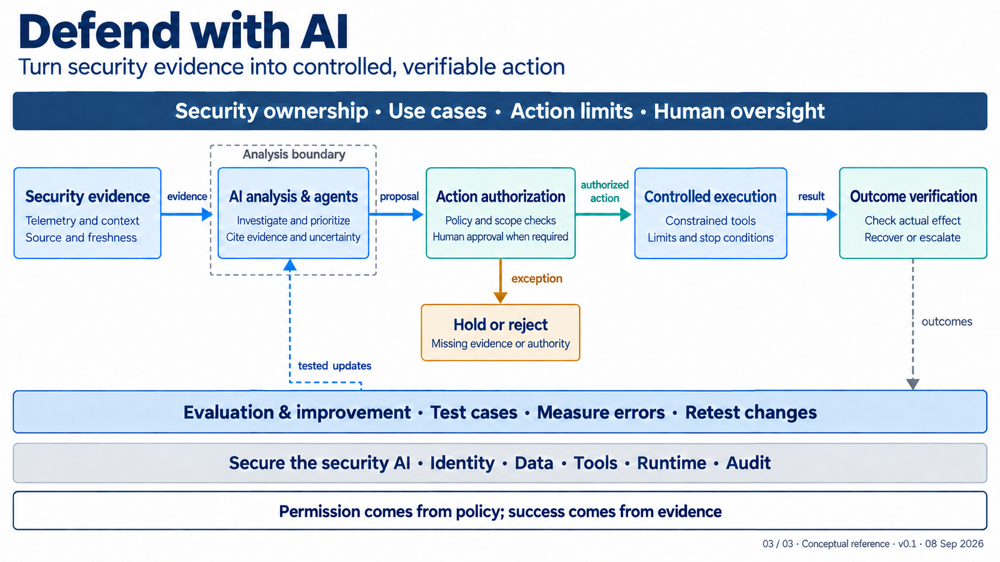

# Architect handoff: 03 — Defend with AI

**Status:** Proposed elaboration. Canonical view defines the proposal; this guide explains it. Neither records an accepted decision, implementation, or operating authority.

**Canonical architecture:** [03-defend-with-ai.md](../03-defend-with-ai.md)

## Contents

1. [Purpose, scope, and status](#1-purpose-scope-and-status)
2. [How to read the view](#2-how-to-read-the-view)
3. [Logical capabilities and the operating envelope](#3-logical-capabilities-and-the-operating-envelope)
4. [Main flow: evidence to verified outcome](#4-main-flow-evidence-to-verified-outcome)
5. [Modes of operation](#5-modes-of-operation)
6. [Boundaries, bands, and security of the security AI](#6-boundaries-bands-and-security-of-the-security-ai)
7. [Exception, revocation, and uncertain outcomes](#7-exception-revocation-and-uncertain-outcomes)
8. [Evaluation, improvement, and operational dependencies](#8-evaluation-improvement-and-operational-dependencies)
9. [Proposed decision register](#9-proposed-decision-register)
10. [Deployment requirements and testable acceptance checks](#10-deployment-requirements-and-testable-acceptance-checks)
11. [Architect questions and glossary](#11-architect-questions-and-glossary)
12. [Sources and relationship to the series](#12-sources-and-relationship-to-the-series)

## 1. Purpose, scope, and status

Architecture 03 turns security evidence into controlled, verifiable action. It covers AI-assisted prevention, exposure assessment, detection engineering, investigation, response, and recovery support. It includes statistical detection, assistants, and tool-using agents; it does not assume broad unattended production control.

The diagram is a capability view. A box names a responsibility, not a product, cloud, model, agent framework, team structure, or procurement decision. One platform may implement several capabilities, and one capability may span several products. Map logical capabilities to physical design only after selecting the use case and assessing evidence, authority, and recovery.

The guidance is evolving: NIST's Cyber AI Profile was a draft; OWASP's agent-control work is emerging; NCSC's advice is interim or a developing blueprint. These sources inform questions to test, not an effectiveness claim. [NIST Cyber AI Profile](https://www.nccoe.nist.gov/projects/cyber-ai-profile), [NCSC agentic-AI risk advice](https://www.ncsc.gov.uk/blogs/managing-the-cyber-risk-of-agentic-ai), and [OWASP Agent Control Standard](https://genai.owasp.org/resource/agent-control-standard-acs/) are the relevant primary references.

## 2. How to read the view

Read left to right. **Security evidence** supplies attributable observations and context. **AI analysis & agents** produce an evidence-linked interpretation or proposal. **Action authorization** decides if an action, target, and scope are permitted. **Controlled execution** carries out authorized action through constrained interfaces. **Outcome verification** tests actual effect and need for recovery or escalation.

Each solid connector has a distinct semantic:

| Connector | Meaning | Required interpretation |
|---|---|---|
| **evidence** | A transfer of attributable observations and relevant context from security evidence to analysis. | It is input to analysis, never authority to invoke a tool. |
| **proposal** | A candidate finding or action from analysis to authorization. | It includes cited support, stated uncertainty, requested target and scope; it is not a command. |
| **authorized action** | A bounded permission from authorization to execution. | It binds the permitted operation to identity, target, scope, limits, and time or other validity conditions. |
| **result** | Execution status and destination-system response from execution to verification. | It reports an attempt and observed response; it does not prove success. |
| **exception** | A path from authorization to hold or reject. | It means evidence, authority, scope, or current conditions were insufficient or conflicted. |
| **outcomes** (dashed) | Verified and uncertain results sent from verification to evaluation. | It informs measurement and test design; it does not automatically train a model. |
| **tested updates** (dashed) | An evaluated, approved change returned to analysis. | It represents controlled improvement after testing and change approval, never automatic promotion. |

The solid path separates interpretation, permission, execution, and verification. The dashed path separates incident content from changed analytic behavior.

The wide top band, **Security ownership · Use cases · Action limits · Human oversight**, governs every central node. It establishes the task, mode, escalation, fallback, and review expectations. Likely functions include security leadership, incident response, detection engineering, risk or governance, and service owners; these are suggestions, not assignments. A use-case record should name the objective, evidence, allowed mode, prohibited actions, affected services, escalation contact, and test basis.

The footer identifies a conceptual reference, version, and date. It prevents the picture being mistaken for a deployment diagram, procedure, or client-specific design.

## 3. Logical capabilities and the operating envelope

The top band should produce an operating envelope for each use case, decided outside model output. It states readable evidence, permitted callers and proposals, approval needs, pre-authorized procedures, and hold conditions. It also identifies service impact that makes a reversible operation consequential.

Session revocation may be reversible but still interrupt critical work. The organization must judge consequence for the application, population, time, and operating condition.

The principle band at the base says: **“Permission comes from policy; success comes from evidence.”** Policy determines whether an action may be attempted; an inference, a generated explanation, a self-reported confidence value, or agreement among models does not do so. Evidence from destination systems determines whether the intended effect occurred. A confidence score can help an analyst understand model uncertainty, but cannot become authority. This distinction is central to the architecture.

## 4. Main flow: evidence to verified outcome

### 4.1 Security evidence

**Purpose.** This box collects the telemetry and context that make a security question answerable: event records, identity and asset context, threat information, relevant case history, and other source-attributed records. Its labels, “Telemetry and context” and “Source and freshness,” require both content and provenance.

**Interfaces and outputs.** The interface should provide source identity, observation and retrieval time where relevant, collection status, access classification, and a stable analyst-visible reference. It sends evidence into analysis; it does not grant uncontrolled repository access.

**Implementation considerations and limits.** Preserve original references so summaries are not the sole record. Enforce access and retention at the evidence service. Logs, tickets, alerts, web content, and threat reports may contain hostile text; analyze it as evidence, never as instruction. OWASP identifies prompt injection, insecure output handling, and retrieval weaknesses as relevant risks. [OWASP GenAI LLM Top 10 2026](https://genai.owasp.org/resource/owasp-genai-llm-top-10-2026/).

Surface stale, unavailable, incomplete, or conflicting sources. Analysis may assist with a limitation statement, but a dependent proposal is held. Likely functions: security operations, detection engineering, identity or asset owners, data platform, and privacy or records.

### 4.2 AI analysis & agents

**Purpose.** This capability correlates, summarizes, prioritizes, investigates, proposes detections or remediation, and exposes uncertainty. It receives the evidence connector and emits a proposal. Its dashed **analysis boundary** says that generated interpretation is contained here.

**Inputs and outputs.** A useful output includes the question, records consulted, observed facts, inference, uncertainty, requested action, target, scope, and evidence links. It separates observation from interpretation and is never the authorization artifact.

**Implementation considerations and limits.** Read-tool use is tied to the allowed task and identity. Context and memory need access controls, provenance, retention, and tamper protection. OWASP identifies goal manipulation, tool misuse, privilege issues, supply-chain risks, and poisoned memory or context. [OWASP Top 10 for Agentic Applications 2026](https://genai.owasp.org/resource/owasp-top-10-for-agentic-applications-for-2026/). MITRE ATLAS and ATT&CK support AI-specific and enterprise attack scenarios. [MITRE ATLAS](https://atlas.mitre.org/) and [MITRE ATT&CK](https://attack.mitre.org/).

The dashed boundary is not itself a security control. Analysis cannot alter authorization policy or bypass execution controls. Failure, timeout, conflict, or hostile content yields an incomplete finding, human investigation, or hold. Analysts need a non-AI route.

### 4.3 Action authorization

**Purpose.** This capability decides whether the specific proposed action may proceed now. The visual label, “Policy and scope checks / Human approval when required,” makes it the authority boundary.

**Inputs and outputs.** It receives the proposal, policy, operating envelope, identities, target attributes, and current conditions. It emits an authorized-action artifact or exception. The artifact binds operation, target, scope, identity, validity, and limits for independent enforcement. It may map to a policy service, workflow approval, identity service, ticket state, or several services.

**Limits and failure handling.** Authorization is independent of generated text; the agent cannot amend its policy. Recheck conditions before execution. Unavailable policy, missing evidence, excess scope, pending human decision, or ambiguity sends a proposal to hold or reject. A confidence score cannot replace policy. Likely functions: incident response, security operations, service owners, IAM, and control owners.

### 4.4 Controlled execution

**Purpose.** This capability takes an authorized action through constrained tools. Its labels, “Constrained tools” and “Limits and stop conditions,” mean tools perform the minimum allowed operation and remain outside the analysis boundary.

**Interfaces and outputs.** A constrained adapter translates authorization into a destination request, enforcing target, operation, identity, credential scope, rate, validity, and stop condition. It returns a result to verification. Credentials are scoped to the needed function and kept outside model context where feasible.

**Implementation considerations and limits.** Reject wrong-target, altered-scope, expired, replayed, and unrecognized requests. Audit authorization, request, response, and actor. An emergency stop prevents new executions or disconnects tools as designed; it does not undo an accepted change. NCSC advises constraints outside prompts, restricted environments, oversight, monitoring, and emergency shutdown. [NCSC: Managing the cyber risk of agentic AI](https://www.ncsc.gov.uk/blogs/managing-the-cyber-risk-of-agentic-ai).

If an adapter fails, it sends a failure or uncertain result rather than silently retrying until an action takes effect. A retry needs an explicit policy for idempotency, target state, and service impact. Likely functions: security engineering, platform engineering, system owners, identity and access management, and incident response.

### 4.5 Outcome verification

**Purpose.** This capability checks actual effect using destination-system evidence, detects unintended consequences, and decides whether recovery or escalation is needed. Its “Check actual effect / Recover or escalate” labels distinguish an execution acknowledgement from containment or recovery.

**Inputs and outputs.** It receives execution results plus independent identity, endpoint, application, network, or other destination records. It sends outcomes to evaluation and leaves the case open, escalates it, or records an evidence-backed conclusion. State checks performed, sources and time, result, uncertainty, and service impact.

**Limits and failure handling.** An acknowledgement can be incomplete, delayed, or misleading. Missing or conflicting evidence means uncertain, then escalation. Recovery may be available but is not guaranteed; plan it before permitting consequential action. Likely functions: security operations, incident response, system owners, and service management.

## 5. Modes of operation

The three modes are selectable operating choices, not a maturity ladder.

| Mode | What the capability may do | Boundary and evidence expectation |
|---|---|---|
| **Assist** | Summarize a case, correlate evidence, or draft an investigation aid. | Read access is scoped. The output cites evidence and separates observation from interpretation. No production action is invoked. |
| **Recommend** | Propose a detection change, containment step, or remediation action. | The proposal identifies affected assets, requested scope, expected consequences, uncertainty, and supporting evidence for review. |
| **Act within limits** | Execute a narrowly scoped response inside a tested and authorized procedure. | Authorization and constrained execution enforce target, scope, and limits; results are verified and an operator can intervene. |

Mode selection belongs in the use-case record. Useful assistance does not authorize later automated action.

## 6. Boundaries, bands, and security of the security AI

The picture has four boundaries that deserve explicit design treatment.

1. **Telemetry to interpretation.** Evidence can include hostile content. Keep source text as data, prevent it from becoming workflow instructions, and preserve source attribution.
2. **Inference to authority.** The analysis boundary encloses interpretation. Authorization is outside it. The agent cannot rewrite the permission policy that governs its work.
3. **Authorization to production.** Bind permission to the operation and target; enforcement and credentials sit in controlled adapters, not model output.
4. **Execution to closure.** Verification relies on destination evidence and keeps uncertain cases open.

The light-blue lower band, **Evaluation & improvement · Test cases · Measure errors · Retest changes**, governs changes to the central flow. The grey foundation band, **Secure the security AI · Identity · Data · Tools · Runtime · Audit**, spans every box and evaluation system: identities, least privilege, protected data paths, tool controls, runtime hardening, audit, supply chain, monitoring, and incident procedures.

NCSC's Cyber Shield supports the direction of AI-assisted vulnerability work, detection, and controlled mitigation while recognizing unresolved engineering challenges. [NCSC Cyber Shield](https://www.ncsc.gov.uk/blogs/cyber-shield-the-path-to-an-agentic-ai-future-for-cyber-defence). Test the platform as AI and enterprise software: compromised identities, tool misuse, poisoned context, changed dependencies, unavailable telemetry, and service failure.

## 7. Exception, revocation, and uncertain outcomes

The orange **Hold or reject / Missing evidence or authority** box is a normal operational path, not an error state to optimize away. It receives the exception connector when authorization cannot establish permission for the requested action. A hold preserves the case for investigation or later evidence; rejection records that the request is outside policy or otherwise invalid. The detailed workflow should distinguish those dispositions and name the owner who can reconsider a hold.

Consider the canonical example: analysis correlates a suspicious login, endpoint alert, and the user's access to a critical application. It proposes session revocation. Authorization evaluates the proposed user, relevant applications, operating envelope, and current conditions.

* If the action is inside a tested pre-authorized procedure, authorization may issue a bounded session-revocation permission. The adapter requests revocation from the identity platform. Verification must then consult the identity platform and the relevant application-session evidence.
* If the policy requires an analyst decision because critical work may be interrupted, the proposal remains pending until the decision is recorded. Analysis cannot decide on its own.
* If the identity platform says revoked but the application reports an active session, the outcome is ambiguous. Preserve both records, assess exposure and service impact, and escalate.
* If the adapter times out after sending, destination receipt is unknown. Verify before any retry; a retry needs authorization for current state.
* If revocation fails or evidence is unavailable, record uncertainty or failure, invoke applicable recovery or containment procedures, and continue human-led response. No rollback, revocation, or containment is guaranteed.

This shows why “result” is execution reporting while “outcomes” evaluates security and service state.

## 8. Evaluation, improvement, and operational dependencies

Evaluation turns outcomes into testable knowledge. Test historical and held-out cases, hostile ticket or log content, wrong-target and replay attempts, policy failures, emergency stop, outages, and changed models or tools. Compare investigation quality, verified-containment time, false positives and negatives, unintended-action rate, and overrides. These are context-specific evidence, not universal thresholds; demonstrations do not prove local effectiveness.

The dashed return arrow returns tested updates to **analysis only**: a revised retrieval rule, prompt, analytic logic, tool schema, detection suggestion, or evaluation case. It requires change review, testing, and an explicit deployment decision before it alters production analysis. A policy, authorization, or execution-control change is separately authorized and deployed to its own component; it never returns through this arrow as authority. Incident content must not silently become training data or policy change.

Off-diagram dependencies include source owners, asset and identity inventories, case management, time synchronization, secrets, privileged access, change management, service-impact assessment, legal/privacy/retention, communications, and continuity. Record required dependencies, availability assumptions, classifications, and manual fallback per use case.

## 9. Proposed decision register

The following are proposed design decisions derived from the canonical view. They need owner review before becoming implementation requirements.

| ID | Proposed choice | Rationale | Alternative / tradeoff | Revisit condition |
|---|---|---|---|---|
| WAI-D01 | Separate analysis from authorization and execution. | Generated interpretation must not grant production permission. | A single workflow is simpler but creates stronger coupling and a harder assurance problem. | A platform architecture proves equivalent independent enforcement. |
| WAI-D02 | Bind authorization to action, target, scope, and current conditions. | Limits wrong-target and stale-proposal risk. | Broad standing authority is faster but raises consequence of error or compromise. | A use case demonstrates a differently bounded, testable need. |
| WAI-D03 | Treat uncertain verification as open work. | An acknowledgement does not prove intended effect. | Closing on execution response can hide residual exposure. | Destination evidence quality or recovery design changes. |
| WAI-D04 | Use a hold-or-reject path for missing evidence or authority. | It makes incomplete or prohibited decisions visible. | Forced decisions can create unsupported action. | The operating envelope and escalation process are agreed. |
| WAI-D05 | Make improvement a tested return path, not automatic learning. | Incident content and outcomes can be misleading or adversarial. | Continuous updates require stronger controls and evidence. | A separately governed learning pipeline is designed and evaluated. |
| WAI-D06 | Start with the mode suited to the use case. | Modes have different evidence and assurance needs. | A fixed maturity sequence misstates risk. | Measured results and policy justify a mode change. |

## 10. Deployment requirements and testable acceptance checks

Before deploying a use case, the detailed design should establish these requirements. They are acceptance checks to test, not an assertion that the reference view already satisfies them.

| Requirement | Testable acceptance check |
|---|---|
| Defined use case and operating mode | A reviewable record names the task, evidence sources, selected mode, affected systems, manual fallback, and prohibited actions. |
| Evidence provenance and access | Test evidence retrieval and confirm source reference, freshness status, classification, and access restrictions are available to the workflow and reviewer. |
| Hostile-content resistance | Insert a malicious instruction in permitted test evidence and confirm it cannot alter policy, expand scope, or trigger a production action. |
| Independent authorization | Attempt to submit model-generated or altered action data directly to execution; confirm execution rejects it without a valid bounded authorization. |
| Scope and replay protection | Test wrong target, changed scope, expired permission, duplicate request, and unauthorized caller; confirm the constrained interface rejects each according to the design. |
| Human decision where required | Exercise an out-of-envelope case and confirm it reaches a recorded human decision or hold, with no execution before it. |
| Verification and ambiguity | Simulate acknowledgement without destination effect and conflicting destination evidence; confirm the case is recorded as uncertain and escalated rather than closed. |
| Stop and continuity | Exercise the emergency stop and model or telemetry outage. Confirm new actions are prevented as designed and analysts can work through the documented non-AI procedure. |
| Change control and evaluation | Change a model, prompt, tool, data source, policy, or evaluation data; confirm the stated retest and approval process runs before production use. |
| Auditability | Trace a test case from evidence through proposal, authorization, execution, verification, and disposition without relying on a generated summary alone. |

These checks should be adapted to the business consequence and technical behavior of the selected task. No numerical threshold is supplied because acceptable performance and risk are organization- and use-case-specific. The requirement to test recovery is not a claim that every action can be rolled back.

## 11. Architect questions and glossary

### Architect questions

1. What security task has adequate source-attributed data and a measurable current baseline?
2. Which facts must be fresh at authorization time, and which system is authoritative for each fact?
3. What is the smallest target and action scope that remains useful?
4. Which consequences make the action require a human decision even if technically reversible?
5. What independent destination evidence would prove the intended effect, and how are conflicts handled?
6. What happens when policy, telemetry, identity, the model, a tool adapter, or a destination system is unavailable?
7. Which records may contain attacker-controlled content, and how is it contained as evidence rather than instruction?
8. Who maintains the operating envelope, tests, change approval, escalation, and manual fallback? These are functions to assign during detailed design.
9. What identities, secrets, dependencies, and audit records does the security-AI platform itself require?
10. Which changes need retesting, and what evidence is sufficient for an accountable deployment decision?

### Glossary

**Action authorization:** Independent decision and artifact permitting an operation within a defined scope.

**Analysis boundary:** Dashed separation of interpretation from authorization and execution; not itself an enforcement mechanism.

**Controlled execution:** Destination-system invocation through adapters enforcing authorization.

**Evidence:** Source-attributed observations and context. It is not automatically permission.

**Hold or reject:** Exception disposition for missing evidence or authority, prohibited scope, or unresolved conditions.

**Logical capability:** Reference-architecture responsibility independent of product or deployment.

**Operating envelope:** Policy-defined use-case mode, scope, action limits, escalation, and fallback.

**Outcome verification:** Destination evidence and service-condition check for actual effect and uncertainty.

**Proposal:** Structured analytic output requesting review or authorization; not an executable command.

**Security AI:** AI-enabled security-analysis environment, including its data, tools, identities, runtime, and audit needs.

## 12. Sources and relationship to the series

This architecture cites the following primary sources from the research basis, checked 8 September 2026. Their status matters: NIST IR 8596 was an initial preliminary draft, OWASP sources are guidance or emerging projects, NCSC's agentic-AI advice is interim, and MITRE knowledge bases are living references. They inform risk selection and design questions; they do not approve this architecture.

* [NIST Cyber AI Profile project and NIST IR 8596 initial preliminary draft](https://www.nccoe.nist.gov/projects/cyber-ai-profile)
* [OWASP Top 10 for Agentic Applications 2026](https://genai.owasp.org/resource/owasp-top-10-for-agentic-applications-for-2026/)
* [OWASP GenAI LLM Top 10 2026](https://genai.owasp.org/resource/owasp-genai-llm-top-10-2026/)
* [OWASP Agent Control Standard](https://genai.owasp.org/resource/agent-control-standard-acs/)
* [NCSC: Managing the cyber risk of agentic AI](https://www.ncsc.gov.uk/blogs/managing-the-cyber-risk-of-agentic-ai)
* [NCSC: Cyber Shield — the path to an agentic AI future for cyber defence](https://www.ncsc.gov.uk/blogs/cyber-shield-the-path-to-an-agentic-ai-future-for-cyber-defence)
* [MITRE ATLAS](https://atlas.mitre.org/) and [MITRE ATT&CK](https://attack.mitre.org/)

The canonical view refers to Architecture 1 for identity, data, tool, runtime, and supply-chain protections of the security-AI platform. A detailed Architecture 03 implementation should establish those protections before it is trusted with security evidence or controlled tools. Architecture 03 adds the security-work flow through authorization, execution, and verification; it makes no cross-architecture decisions.
