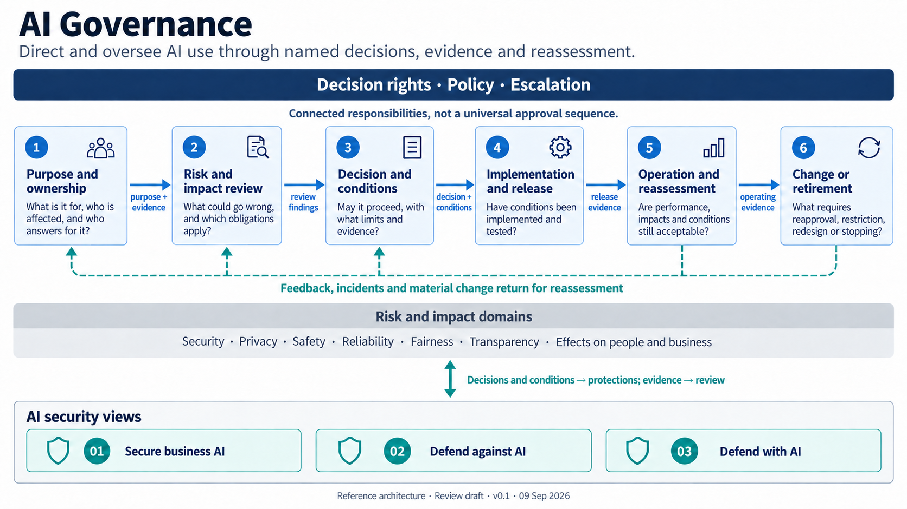

# AI Governance: architect reference guide

**Guide version:** 0.1 | **Prepared:** 9 September 2026 | **Status:** Review draft

**Canonical architecture:** [04-ai-governance.md](../04-ai-governance.md). **Visual:** [04-ai-governance.png](../../public/images/04-ai-governance.png). **PDF:** [04-ai-governance-guide.pdf](../../public/downloads/04-ai-governance-guide.pdf).

## Contents

1. [Purpose and reading rules](#1-purpose-and-reading-rules)
2. [Authority allocation](#2-authority-allocation)
3. [Every responsibility explained](#3-every-responsibility-explained)
4. [Connections and feedback](#4-connections-and-feedback)
5. [Risk and impact domains](#5-risk-and-impact-domains)
6. [Interfaces with AI security](#6-interfaces-with-ai-security)
7. [Worked examples](#7-worked-examples)
8. [Failure behavior and evidence](#8-failure-behavior-and-evidence)
9. [Architect handoff and acceptance](#9-architect-handoff-and-acceptance)

## 1. Purpose and reading rules

The diagram answers: **How does an organization make and revisit accountable decisions about AI use?** It covers AI that is built, bought, embedded in another product or unmanaged. Those are overlapping discovery prompts, not exclusive categories.

The six boxes are responsibilities. They can be performed through existing product, procurement, risk, privacy, security, legal, safety, quality, release, incident and assurance processes. The row is a useful reading order, but real work loops, branches and returns. An urgent incident may move directly from operation to restriction; a material provider change may return implementation to risk review; an unmanaged use may begin with discovery during operation.

The top band applies to every box. Decision rights say who may make which decision. Policy supplies rules and thresholds. Escalation gives uncertainty, conflict, missing evidence and urgent exceptions a named destination. None of these labels is an actor. Every implementation must replace them with named people or assigned roles.

The diagram separates governance and security while connecting them. Governance does not become a fourth security view. The three security views implement protections and return evidence within the purpose, conditions and authority established by the relevant decision owners.

## 2. Authority allocation

Start with decisions, then map them to the organization. A useful authority record names the decision, decision owner, advisers, implementer, evidence producer, independent checker when required, escalation owner, and the person allowed to accept an exception or stop the use.

| Decision | Typical accountable role to resolve locally | Required inputs | Recorded output |
|---|---|---|---|
| Establish business purpose and outcome | Business or service owner | Need, affected process, users, expected benefit and consequence of error | Use-case record and accountable owner |
| Permit data use | Data owner and applicable privacy/legal authority | Data origin, permitted purpose, affected people, sensitivity, destination and retention | Allowed and prohibited uses with conditions |
| Accept security risk | Role holding delegated security or enterprise risk authority | Threats, exposure, controls, test results, residual risk and recovery | Accepted, conditioned, escalated or rejected risk decision |
| Release the use | Assigned release or operational owner | Conditions, evaluation results, control evidence, unresolved limitations and rollback readiness | Version-bound release decision |
| Continue, restrict or stop | Business owner plus authorities relevant to the trigger | Operating evidence, incidents, feedback, impact changes and alternatives | Continued use, new conditions, hold, redesign or retirement |

A coordinating AI governance office may maintain the intake, inventory, meeting cadence, evidence record and escalation route. It does not acquire every decision in this table merely by coordinating them. Where several authorities disagree, policy must say who resolves the conflict or whether the use remains held.

Security holds business accountability only when the security function owns the use case, such as a security investigation assistant, or when a specific security decision has been delegated to it. Finance can remain accountable for a payment outcome while security owns identity controls and incident response. Privacy may decide whether a data use is permitted while the business owner decides whether the use remains worthwhile.

## 3. Every responsibility explained

### 3.1 G-01 Purpose and ownership

**Purpose.** Describe the decision or work the AI supports, the people and processes affected, the intended outcome, and the consequence of error. Identify the accountable owner and the people permitted to change the purpose.

**Inputs.** Business need, workflow description, users, affected parties, data and action inventory, origin path, alternatives and current operating process.

**Outputs.** A use-case identifier; plain-language purpose; accountable owner; affected parties; proposed scope; prohibited uses; benefit hypothesis; initial success, harm and retirement criteria.

**Decisions.** Is AI appropriate for this purpose? Is the use advisory, preparatory or authorized to act? Does the benefit justify further assessment? Who answers for the outcome?

**Evidence.** Approved purpose statement, owner acceptance, process map, affected-party analysis and inventory linkage. A vendor description or model card cannot establish the organization's purpose.

**Failure behavior.** If no owner accepts the outcome, or the purpose is too broad to assess, hold the use. Discovery of unmanaged use creates an intake and containment decision; it does not retroactively approve the activity.

### 3.2 G-02 Risk and impact review

**Purpose.** Identify plausible failure and misuse, affected people and business outcomes, legal and policy obligations, dependencies, uncertainty and the evidence needed to decide.

**Inputs.** Purpose record, workflow and data flows, model and supplier information, threat scenarios, affected-party input, comparable process evidence and applicable requirements.

**Outputs.** Risk and impact assessment, applicable domains, participating specialists, evidence gaps, proposed controls, severity and likelihood judgments where the organization uses them, and escalation needs.

**Decisions.** Which concerns are material? Which specialists must participate? What evidence could change the decision? What uncertainty is tolerable?

**Evidence.** Scenario analysis, data and system provenance, evaluations, privacy or safety assessment, security design, supplier evidence and documented dissent. Absence of an observed incident is not proof that a risk is acceptable.

**Failure behavior.** If required evidence is unavailable, narrow the purpose, require a supervised trial, select an alternative, pause or reject. Do not convert `not assessed` into low risk.

### 3.3 G-03 Decision and conditions

**Purpose.** A named person or assigned role decides whether the use may proceed and under what limits. The decision must be specific enough to implement and revisit.

**Inputs.** Purpose, risk and impact findings, obligations, alternatives, evidence strength, unresolved uncertainty, proposed controls and exception requests.

**Outputs.** Proceed, proceed with conditions, limited experiment, pause, redesign, reject or retire; permitted users, data, actions and environments; required human decisions; evidence thresholds; expiry and review triggers; exception and stop authority.

**Decisions.** Who accepts which residual consequence? Which conditions are mandatory before release? Which cannot be waived? How long is the decision valid?

**Evidence.** Decision record bound to the use case, system version, conditions, owner, date, expiry and cited evidence. Meeting attendance or an email saying “looks good” is insufficient when it does not identify the approved scope.

**Failure behavior.** Conflicting decisions or expired authority produce a hold and escalation. Emergency exceptions need a narrow scope, named approver, expiry, compensating measures and retrospective review.

### 3.4 G-04 Implementation and release

**Purpose.** Translate the recorded conditions into process, technical and contractual controls; test them; and make a release decision based on evidence.

**Inputs.** Approved conditions, architecture, data rules, supplier commitments, evaluation plan, threat model, operating procedures and rollback requirements.

**Outputs.** Implemented controls, traceability from each condition to evidence, evaluation results, limitations, user guidance, monitoring configuration, incident and rollback procedures, and a version-bound release record.

**Decisions.** Are all mandatory conditions implemented? Do results meet acceptance thresholds? Are known failures visible and bounded? Can the organization stop or recover?

**Evidence.** Control tests, representative evaluations, access and action checks, privacy and safety evidence, supplier review, change approval, user acceptance where relevant, recovery exercise and unresolved-defect record.

**Failure behavior.** A failed mandatory condition blocks release. A partial test is recorded as partial. A model, provider, tool, prompt, data source or policy change can require renewed evidence even if application code did not change.

### 3.5 G-05 Operation and reassessment

**Purpose.** Compare actual performance, impacts and operating conditions with the approved purpose and conditions. Route meaningful evidence to people who can change the decision.

**Inputs.** Outcome measures, errors, complaints, incidents, overrides, control results, data and population shifts, supplier changes, human feedback, assurance findings and operating cost.

**Outputs.** Continued-use assessment, corrective actions, updated conditions, incident response, new evaluation, restriction or escalation to change and retirement.

**Decisions.** Is the use still achieving its purpose? Are harms or failures within accepted limits? Has the context changed? Does the evidence require a hold or new decision?

**Evidence.** Destination-system outcomes, sampling results, incident and complaint records, drift or quality indicators, overrides, access decisions and periodic owner attestations. Model-generated explanations do not verify outcomes.

**Failure behavior.** Missing or unreliable monitoring is itself a governance condition to resolve. Define safe degradation and a non-AI operating route. Do not let an automated monitor accept its own alert or modify its authority.

### 3.6 G-06 Change or retirement

**Purpose.** Decide how material changes, unacceptable operation, replacement and end of use affect authority, data, dependencies and records.

**Inputs.** Change proposal, operating evidence, incidents, revised purpose, provider or model change, new data, new users, new actions, changed obligations and replacement plan.

**Outputs.** Reapproval scope, temporary restriction, redesign, rollback, retirement decision, decommission plan, retained evidence, data disposition and dependency removal.

**Decisions.** Is the change material? Which earlier assessments and conditions must be revisited? Who can order an immediate stop? What records and data must be retained or deleted?

**Evidence.** Change classification, approvals, migration and rollback tests, access revocation, data disposition, dependency removal, user communication and confirmed service state after retirement.

**Failure behavior.** If the system cannot be safely changed or retired, escalate before the need becomes urgent. Retirement is incomplete while identities, connectors, scheduled tasks, data copies or user expectations remain active.

## 4. Connections and feedback

| Connector | Carries | Receiver uses it to | Authority limit |
|---|---|---|---|
| G-01 → G-02: `purpose + evidence` | Purpose, owner, affected parties, scope, origin and initial evidence | Select risks, impacts, participants and evidence needs | The reviewer cannot redefine the business purpose without the owner. |
| G-02 → G-03: `review findings` | Risks, impacts, obligations, options, evidence gaps and dissent | Decide, condition, pause, redesign or reject | Advice is not acceptance; the recorded decision owner decides within authority. |
| G-03 → G-04: `decision + conditions` | Approved scope, limits, required controls, thresholds, expiry and exceptions | Implement, test and prepare release evidence | Implementers cannot weaken conditions silently. |
| G-04 → G-05: `release evidence` | Version, tests, controls, known limitations, procedures and release decision | Establish the operating baseline and monitoring plan | Release does not authorize later material changes. |
| G-05 → G-06: `operating evidence` | Outcomes, incidents, feedback, control performance and changes | Restrict, reapprove, redesign, rollback or retire | Monitoring signals trigger decisions; they do not make them. |
| Feedback loop → G-01–G-03 | Incidents, material change, new evidence and affected-party feedback | Revisit purpose, risk and conditions | Only the applicable decision owner may alter authority. |

The diagram omits many shortcuts to remain readable. An incident can trigger an immediate authorized hold. A new obligation can return any stage to risk review. A purpose change returns to G-01. A failed release condition returns to implementation or decision. The deployment should record these routes in its workflow and evidence model.

“Material change” needs local thresholds. Examples include a new decision purpose, affected population, data category, model or provider, tool permission, autonomy level, external destination, control failure, legal obligation, recurring harmful outcome or recovery limitation. A routine patch may still be material if it changes behavior or evidence.

## 5. Risk and impact domains

| Domain | Questions | Possible evidence | Likely participants |
|---|---|---|---|
| Security | Can the AI, its data, identities or tools be manipulated, disclosed or misused? Can the organization contain and recover? | Threat model, access tests, action-control evidence, incidents, recovery exercises | Security, identity, application, infrastructure and incident owners |
| Privacy | Is personal information used for an allowed purpose with appropriate notice, rights, minimization and retention? | Data inventory, privacy assessment, consent or authority record, deletion tests | Privacy, legal, data owner and affected process owner |
| Safety | Could operation cause physical, psychological or other unacceptable harm? | Hazard analysis, safety cases, supervised trials, stop tests | Safety specialists, domain experts and accountable owner |
| Reliability | Does it perform consistently enough for the context and fail in a bounded way? | Representative evaluations, error analysis, stress tests, fallback results | Product, engineering, quality, operations and domain experts |
| Fairness | Are outcomes or burdens distributed inappropriately across affected groups? | Dataset analysis, subgroup evaluation, appeal and complaint evidence | Business owner, domain experts, legal, privacy and affected-party representatives |
| Transparency | Can affected people and operators understand AI's role, limits and routes for challenge? | Notices, user research, decision records, provenance and appeal procedures | Product, legal, communications, operations and assurance |
| People and business | Does it support the intended outcome without degrading work, accountability, service or resilience? | Outcome measures, workflow observation, workforce and customer feedback, continuity tests | Business owner, operations, workforce, customer and resilience roles |

This list is a review prompt, not a claim that every use needs seven separate assessments. Combine work where evidence and authority align. Keep distinct decisions visible where they do not.

## 6. Interfaces with AI security

### 6.1 Secure business AI

Governance sends the approved purpose, data-use eligibility, user scope, autonomy limit, action conditions, release tests, exception authority and reassessment triggers. Architecture 01 turns those into access, data, tool, action, evidence and recovery controls. It returns enforcement decisions, denied or held actions, verified business outcomes, incidents, control gaps and change signals.

Access permission is necessary but not enough. A user may be allowed to read supplier data while the proposed model use is unsuitable or the data is unfit for the decision. Governance resolves that appropriateness question; security enforces the resulting access and action rules.

### 6.2 Defend against AI

Governance supplies priority scenarios, protected outcomes, risk tolerance, containment authority, notification obligations and recovery conditions. Architecture 02 supplies threat intelligence, exposure and control evidence, detected behavior, incident consequences, containment results and residual risk. It should defend the organization based on observable behavior without requiring proof that an attacker used AI.

### 6.3 Defend with AI

Governance defines the approved security purpose, source and evidence rules, action limits, human decision points, execution authority and improvement boundaries. Architecture 03 returns source-linked findings, recommendations, approvals, execution and destination outcomes, errors and evaluation evidence. An AI recommendation cannot authorize itself, and an improvement loop cannot expand production capability outside assigned authority.

## 7. Worked examples

### 7.1 Supplier-payment assistant

**Purpose and owner.** Finance proposes an assistant that reads supplier-change requests and prepares a recommendation. The finance process owner answers for paying the correct supplier. Security owns assigned identity, access and incident decisions; privacy and data owners decide applicable data conditions.

**Review.** The team considers fraudulent instructions, compromised accounts, unsuitable source data, erroneous matches, disclosure, weak explanations, operator overreliance and business interruption. Bought software with embedded AI is recorded under both arrival paths; lack of current inventory coverage may also make part of the use unmanaged.

**Decision.** The assistant may prepare a change but may not authorize or execute it. A human follows the established supplier verification and payment-change approval process. Approval must bind to the exact supplier record and destination. Missing independent verification results in a hold.

**Release.** Tests cover permitted data, hostile content, conflicting records, exact-action approval, duplicate requests, unavailable verification, denied execution and recovery. Evidence links the released version to its conditions.

**Operation and change.** Finance checks confirmed payment outcomes, overrides, holds and complaints. Security reviews suspicious identity and application activity. A new capability to execute changes, a new model provider or repeated false recommendations returns the use for reassessment. Retirement removes identities, connectors, retained data and scheduled tasks and confirms the final system state.

### 7.2 Embedded meeting summary

A purchased collaboration platform enables an embedded AI summary feature. The same use is bought and embedded. If enabled before inventory and ownership, it is also unmanaged. Intake identifies meeting participants, sensitive topics, retention, accuracy needs and who may receive summaries. The assigned business, privacy and data owners may permit limited groups with data conditions and notice, require an evaluation, or disable the feature until evidence is available. Security owners enforce access and sharing rules within their authority.

### 7.3 Security investigation assistant

The security function owns the use purpose and the investigation outcome within its mandate. Governance still requires data rules, action limits, evaluation and reassessment. Architecture 01 protects the assistant, Architecture 02 supplies threat and incident context, and Architecture 03 governs evidence-linked analysis and controlled response. Recovery or account restriction uses the authority assigned to that action, not the model's confidence.

## 8. Failure behavior and evidence

| Failure or uncertainty | Expected behavior | Minimum evidence |
|---|---|---|
| No accountable owner | Hold intake or contain unmanaged use | Unresolved-owner record and escalation |
| Purpose too broad or changes materially | Return to G-01 and reassess | Revised purpose, affected parties and decision |
| Required evidence missing | Narrow, test under supervision, pause or reject | Gap, interim condition, owner and expiry |
| Authorities disagree | Follow named conflict escalation; keep use held if unresolved | Positions, resolver, decision and rationale |
| Mandatory control or evaluation fails | Block release or restrict operation | Failed condition, defect, remediation and retest |
| Monitoring is unavailable | Use safe degradation or suspend according to conditions | Outage, decision, fallback and restored evidence |
| Harm, incident or complaint exceeds threshold | Contain, support affected parties and reassess | Event, action authority, outcome and review trigger |
| Emergency exception requested | Use narrow delegated authority with expiry | Approver, scope, reason, compensating measure and retrospective review |
| Provider or embedded feature changes | Classify materiality and repeat affected review | Change notice, comparison, tests and decision |
| Retirement leaves residual access or data | Keep closure open and remediate | Revocation, deletion or retention record and destination verification |

Acceptance evidence should show both control behavior and business outcome. Useful evidence includes purpose and owner records, applicable policies, assessment inputs, decision and exception records, version-bound evaluations, access and action logs, destination-system results, incidents, complaints, reassessment outcomes, rollback exercises and confirmed retirement. Evidence has an owner, source, date, scope and retention rule. Set expiry where evidence can become stale.

Do not accept these substitutions: a model explanation for a verified outcome; a vendor claim for a local test; successful access for appropriate data use; review attendance for a decision; an absence of complaints for an absence of harm; monitoring for authority; or publication of this architecture for implementation evidence.

## 9. Architect handoff and acceptance

Before detailed design, resolve:

1. What is the use-case identifier, purpose, affected population and accountable outcome owner?
2. Which built, bought, embedded and unmanaged discovery prompts apply?
3. Which people or roles hold each decision, exception, release, stop and retirement right?
4. Which existing processes perform each responsibility, and where are the gaps?
5. Which risk and impact domains are material, and who supplies independent challenge?
6. What conditions are enforceable, and which rely on procedure or contract?
7. What evidence is required before release and during operation, who produces it and when does it expire?
8. What events count as material change, and who can impose an immediate hold?
9. How do all three security views exchange conditions, incidents and evidence with governance?
10. What safe fallback, recovery and retirement actions exist, and who authorizes them?

A design is ready for an implementation decision when the named decision owners can explain the purpose, conditions, residual risks, evidence limits, escalation paths and stop criteria; every mandatory condition maps to an implementation and test; operating evidence can reach someone authorized to change the decision; and retirement can be completed and verified.

This guide and Architecture 04 are review drafts. A separate model-assisted review found no blocking content or visual defects and inspected all 11 PDF pages. Human architectural review and reader comprehension testing remain open. Source-fidelity and visual checks do not establish deployed effectiveness. The earlier Fable disposition for Architectures 01–03 does not apply to this package.

## Sources

- [NIST AI RMF Core](https://airc.nist.gov/airmf-resources/airmf/5-sec-core/): governance across organizational policies, roles and the AI lifecycle; inventories, monitoring, incident response and retirement.
- [NIST AI risks and trustworthiness](https://airc.nist.gov/airmf-resources/airmf/3-sec-characteristics/): related characteristics including reliability, safety, security and resilience, accountability and transparency, explainability and interpretability, privacy and fairness.
- [ISO/IEC 42001:2023 overview](https://www.iso.org/standard/42001): organization-wide AI management-system and continual-improvement context.
- [NIST Cyber AI Profile project](https://www.nccoe.nist.gov/projects/cyber-ai-profile): the three cybersecurity areas used by the companion security series; it does not establish comprehensive AI governance coverage.

Sources checked 9 September 2026. The six responsibilities, authority allocation, connector meanings, examples and acceptance model are proposed synthesis. This is not a standards crosswalk, conformity assessment, legal interpretation or deployed-system assurance.
